[Back](../README.md)

---

# Combination Logic

In this section, we will begin our exploration of the SystemVerilog language by starting with simpler combinational logic circuits.

This practical session is designed to be standalone. However, chapter 3 in [1] will compliment it as supplementary reading.

| TABLE OF CONTENTS |
| - |
[Intended Leaning Outcomes](#Intended-Learning-Outcomes)
[HDLs and Programming Languages](#HDLs-and-Programming-Languages)
[Task 201: Gate Level Modelling](#Task-201:-Gate-Level-Modelling)
[Task 202: Dataflow Modelling](#Task-202:-Dataflow-Modelling)
[Task 203: Behavioural Modelling](#Task-203:-Behavioural-Modelling)
[TASK 204: Logic Levels](#Task-204:-Logic-Values)
[Modelling Delays](#Modelling-Delays)
[Parameters](#Parameters)
[Task 206: Converting a schematic to a Hardware Definition Language](#Task-206:-Converting-a-schematic-to-a-Hardware-Definition-Language)
[Task 207: Schematics and gate models](#Task-207:-Schematics-and-gate-models)
[Task 209: Introduction to Testbenches](#Task-209:-Introduction-to-Testbenches)
[Numeric Literals](#Numeric-Literals)
[Task 210: Data Word Manipulation](#Task-210:-Data-Word-Manipulation)
[Challenges](#Challenges)
[Reflection](#Reflection)
[References](#References)

## Intended Learning Outcomes

By the end of this section, you should be able to:

* Create simple combinational logic components with SystemVerilog modules
* Use _continuous assignment_ to establish logical relationships between points in a circuit
* Build a circuit 'Netlist' from basic gates (convert schematics to text)
* Contrast and apply bit-wise logical operators for building logic functions
* Contrast and use the different supported signal states `1`, `0`, `X`, `?`, `Z`
* Use concatination operators  
* Write components with appropriate commenting and structure
* Use ModelSim to interactively debug a component using modelled delay parameters
* Create a simple testbench to automate the testing of a combinational logic component

## HDLs and Programming Languages
A hardware description language (HDL) such as SystemVerilog, is precisely what it says: a language that describes hardware. It is a language can define the connection of primitive logic components, or at the more abstract level, logical behaviours (such as performing boolean algebra, arithmetic or storage). Ultimately, the output of an HDL is a netlist of interconnected logic components, such as AND, OR and NOT gates. For an HDL, **there is no CPU** - the nearest equivalent is an FPGA, which is an a large collection of pre-synthesised macrocells, containing logic primitives (such as AND, OR, NOT and Latches). The HDL specifies how these gates are connected, thus forming bespoke hardware.

> The output of an HDL is ultimately a netlist of gates and interconnects. The conceptual equivalent is a schematic drawing of gates and wires, and not a programming language.

The resulting hardware is bespoke to match your intent and design, and every circuit is ultimately built from logic gates and wires as described by a HDL. 

A common problem for newcomers is that on first inspection, an HDL *resembles* a programming language, such as C or C++, but the resemblance can be misleading. Like a a programming language, an HDL can describe a behaviour. However with a programming language, the output is not a netlist of gates, but a **sequence** of instructions performed on a pre-defined Central Processing Unit (CPU). 

It is interesting to note that CPU was itself is likely to have been designed with an HDL (at the time of writing, usually in SystemVerilog).

* When we write a computer program to run on a single CPU, we write a sequence of instruction that are performed in turn, one at at time. As our program scales (gets longer and more complex), so the **time** it takes gets longer. The hardware size remains static of course. We might say that as the task scales, so the task grow temporally.

* When we write HDL, we specify behaviour that will be implemented by interconnected logic gates. As our design scales (gets larger and more complex), so the occupied **space** and number of gates increases. We might say that as the task scales, so the task grows spacially.

This is not a physics lesson in theories of space-time, neither is anyone going to get quantum (I'll leave that to those fabricating the ASICs), but it is a useful way to visualise things. You can mix the two, and they often are mixed. We commonly see manufacturers design multi-core processors - adding more (often replicated) silicon (space) to perform more tasks (in parallel). Equally, we can use an HDL to design digital hardware that is sequential, and save silicon by spreading a task out over time. We will meet examples of these towards the end of the course.

An HDL can be written in different styles, with different levels of abstraction from the hardware gates.

* **Structural modelling** involves the description of logic at the level of gates and wires. This is similar to a schematic.
* **Dataflow modelling** is more abstracted, and describes logic by it's function using operators. We typically see the keyword `assign` and boolean expressions.
* **Behavioural modelling** is the most abstracted, and describes logic at the functional and algorithmic level. We typically see the keyword `always` and is commonly used for (but not always) sequential logic.

The more abstraction we use, the more we rely on the tools to synthesise our models in real hardware. However, more abstracted HDL is often more concise, easier to write and clearer to understand.

To start things more gently, we begin with **combination logic**. Combinational logic has no notion of a clock. There are inputs, and there are outputs. Each input produces a specific output. The only role that time plays is in the speed of the synthesised hardware, such as propagation delay. We call such a delay an artefact (unwanted). Ideal hardware would ideally have no delay. With ideal hardware (pure logic), the output changes as soon as the input changes, and that output is entirely stable. In the absence of timing models, simulated hardware outputs change / update in zero time.

Combinational logic can be defined with a **truth table**. For example:

| A | B | Y |
| - | - | - |
| 0 | 0 | 1 |
| 0 | 1 | 0 |
| 1 | 0 | 0 |
| 1 | 1 | 1 |

We might write a Boolean expression to describe this as Y = <span style="text-decoration:overline">A</span> <span style="text-decoration:overline">B</span> + A B, or in the form `Y = 00 + 11`.

Let's now look at how we might model this circuit using different styles and levels of abstraction.

## Task 201: Gate Level Modelling
Let's begin with the least abstracted model, gate level.

| Task 201 | Gate Level |
| - | - |
| 1 | Open the Quartus project in Task-201 |
| 2 | Open the schematic and double-click the uop_nxor component to reveal the HDL |
| - | Read the code and the comments carefully. |
| 3 | Build the project. Quartus not only compiles the HDL, but it also synthesises it for a given FPGA device. We can see this more closely by using the Netlist Viewer  |
| 4 | Click Tools-> Netlist Viewers -> RTL Viewer |
| - | You should see an image similar to the one below.

<figure>
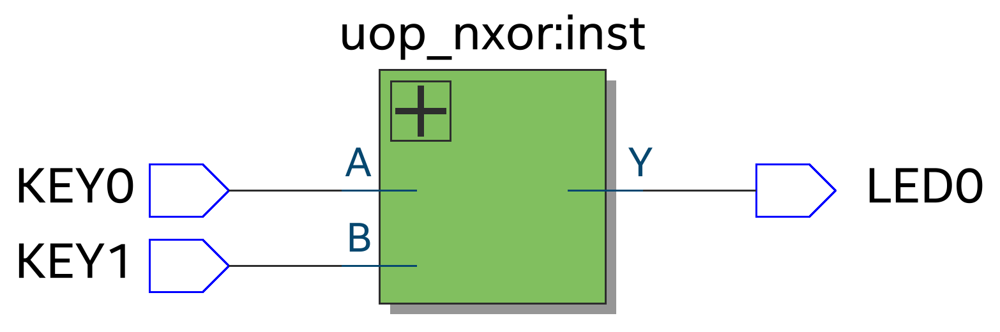
<figcaption>RTL View </figcaption>
</figure>

| 5 | Click the + symbol to expand. You should see a circuit similar to the figure below |
| - | - |

<figure>
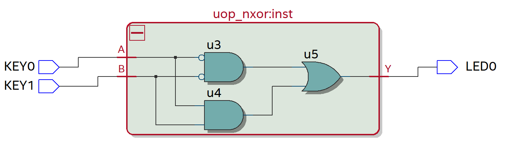
<figcaption>Gate Level View</figcaption>
</figure>

| 6 | Now contrast the figure below with the HLD (shown below)
| - | - |
| - | Note the similarities and differences |
| - | You can also click on u3, u4 and u5 in the navigator |
| Question | Where are `u1` and `u2`? |

```verilog
module uop_nxor(output wire Y, input wire A, input wire B);

//Internal wires
wire Ainv;
wire Binv;
wire term0;
wire term3;

//Place and connect gates
not u1 (invA, A);
not u2 (invB, B);
and u3 (term0, invA, invB);
and u4 (term3, A, B);
or  u5 (Y, term0, term3);
endmodule
```

You can see the very close relationship between the HDL and the synthesised hardware netlist (prior to place and route). This style of HDL is often called **structural** as it also describes the structure of the logic at a gate and wiring level. We say it is the *lowest level of abstraction*. 

To be precise, this is not strictly the final hardware. The actual final physical synthesis will depend on placement and routing for the particular device being targeted (FPGA or ASIC).

> We will soon learn that **structural** HDL is used frequently for integrating other components into our design, including testing. However, most components (modules) themselves are not written with structural HDL as it is slow and error prone.

## Task 202: Dataflow Modelling
Structural HDL is lowest level of abstraction we can describe hardware. The next lowest is often called dataflow modelling.

| Task 202 | DataFlow Level |
| - | - |
| 1 | Open the Quartus project in Task-202 |
| 2 | Open the schematic and double-click the uop_nxor component to reveal the HDL |
| - | Read the code and the comments carefully. |
| 3 | Build the project. |
| 4 | Click Tools-> Netlist Viewers -> RTL Viewer. Expand again by clicking the + symbol |
| - | Once again, you should see an image similar to the one below.

<figure>

<figcaption>Gate Level View</figcaption>
</figure>


| 5 | Now contrast the figure below with the HDL (shown below)
| - | - |
| - | You can also click on `term0`, `term3` and `Y` in the navigator |
| Question | What do `term0`, `term3` and `Y` represent? |

```verilog
module uop_nxor(output wire Y, input wire A, input wire B);

//Internal wires
wire term0;
wire term3;

//Continuous Assignment (order does not matter)
assign Y = term0 | term3;
assign term0 = ~A & ~B;
assign term3 = A & B;

endmodule
```

This style of SystemVerilog is known as **continuous assignment**. Instead of specifying which gates to include, and how to wire them, the HDL describes the logical relationships in terms of primitive operations. Note the operators are the same as the C programming language.

> For a discussion on [SystemVerilog operators][SysVerilogOperators], see [[3](#references)].

Some of the operators [are listed here](Operators.md)


## Task 203: Behavioural Modelling
Behavioural HDL is the highest level of abstraction, and the one most commonly used.

| Task 203 | Behavioural Level |
| - | - |
| 1 | Open the Quartus project in Task-203 |
| 2 | Open the schematic and double-click the uop_nxor component to reveal the HDL |
| - | Read the code and the comments carefully. |
| 3 | Build the project. |
| 4 | Click Tools-> Netlist Viewers -> RTL Viewer. Expand again by clicking the + symbol |
| - | You should see an image similar to the one below.

<figure>
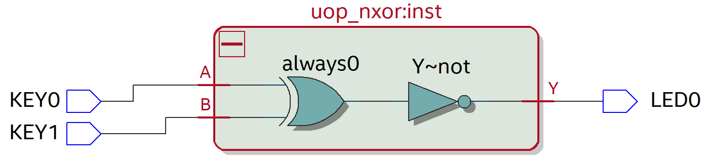
<figcaption>Gate Level View</figcaption>
</figure>


| 5 | Now contrast the figure below with the HDL (shown below)
| - | - |


```verilog
module uop_nxor(output reg Y, input wire A, input wire B);

always @(A or B)
begin
	if (A == B)
		Y = 1;
	else
		Y = 0;
end		

endmodule
```

**Question**: Would you have been able to predict the hardware synthesis from the HDL?

This is written with a **behavioural** style. Note the inclusion of the [verilog][verilog] `always` statement. Much more will be said about this later. For now, you should concentrate on the HDL inside this block:

You will observe HDL that looks very similar to the C programming language. **Remember - there is no CPU being used**. 

* The semantics are very similar to C, but the way it is compiled and synthesised is very different.
* Like C, the **behaviour** is described sequentially. Unlike C, it is (efficiently) synthesised with combinational logic.

> Key Point: As we will learn, behavioural HDL is written in a style where the order of statements is important. However, once again, I want to stress that this is **not** a programming language (there is no CPU!). 
>
> *Behavioural-style HDL is simply a means by which an engineer expresses and defines the required behaviour of hardware through sequential statements*. The compiler and synthesis tools do the magic and turn this into hardware. It may be combinational logic, or sequential.

It is hard to predict how behavioural logic will be synthesised. In this case, the sequential code inside the `always` block resulted in combinational logic. It can also be used to model sequential logic. This can be a little ambiguous and results in accidental latching etc. [SystemVerilog][SysVerilog] has improvements over [Verilog][Verilog] in this regard.

Note also that the output `Y` is not a wire, but a [Verilog][Verilog] `reg`. You cannot write to a wire from within an `always` block. Although the name `reg` suggests register, in *this* case, there are no registers (it is all combinational logic). This is understandably a common source of confusion, and is partly why [SystemVerilog][SysVerilog] introduced `logic` type. 

> Confused? Absolutely! This can be very confusing, but you need to know the rules of all three {`wire`,`reg`,`logic`} as you will see them time and time again. Later in this course we will take a much closer look at behavioural HDL and `always` blocks, where all this will be discussed in more detail.

## Task 204: Logic Values
So far, we have only considered combinational logic where the logic levels were `1` or `0` (true and false). SystemVerilog actually supports 4 possible values:

* Strong LOW: `0` 
* Strong HIGH: `1`
* High Impedance: `z` or `?`
* Unknown `x`

To help you understand the purpose of these 4 states, **watch the following video**:

[VIDEO: Understanding the 4 logic levels in SystemVerilog](https://plymouth.cloud.panopto.eu/Panopto/Pages/Viewer.aspx?id=e937e15c-1541-4bc7-b13c-adb000fcd798)

| TASK 204 | Logic Levels |
| - | - |
| 1 | Open Task204 in Quartus, build and simulate with ModelSim |
| 2 | Simulate the component, again adding the signals to a waveform as shown in the video |
| 3 | Set all inputs LOW as shown in the video |
| 4 | This time, keeping OE LOW, set LE to a 1, simulate for 100ps, then pull LE back to 0 and simulate for another 100ps |
| - | Was there any change in the output? Explain |
| 5 | Now set OE HIGH and simulate for another 100ps |
| - | Again, was there any change in the output? Explain |

In this task, the difference was that output `Y` had been defined before it was enabled. This avoided the 'x' output level as signified by a red trace.

There is more we could say about the `x` (or `?`) levels, but we can defer that to later in the course.

If we use Quartus to inspect the Netlist, we see the following:

<figure>
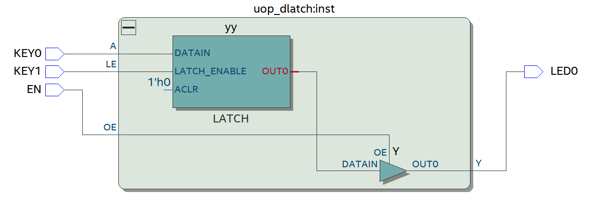
<figcaption>RTL View of the D-Latch, showing the D-Latch connected to a tri-state buffer</figcaption>
</figure>

Now contrast this with the HDL below:

```verilog
module uop_dlatch(
	output reg Y, 	//Output
	input wire A, 	//Data input
	input wire LE, 	//Latch Enable
	input wire OE	//Output Enable
);

//D-Latch, written using Verilog (we will look at SystemVerilog improvements later)

reg yy;				//Note this is type reg

//Continuous Assignment
assign Y = OE ? yy : 1'bz;	// Y is High Impendence is OE == 0

//Behavioural HDL
always @(A, LE)			// Update if A or LE change
begin
	if (LE == 1'b1)		// Set yy to A if LE is equal to 1, otherwise latch (stay unchanged)
		yy <= A;
end

endmodule
```

This is a mixture of dataflow style HDL and behavioural. For the logic related to the output enable `OE`, continuous assignment is used as follows:

```verilog
assign Y = OE ? yy : 1'bz;	// Y is High Impedance is OE == 0
```

where `yy` is internal signal of type `reg` (register). For the behavioural HDL, we see the `always` block and a *sensitivity list* `(A, LE)`:

```verilog
always @(A, LE)			// Update if A or LE change
begin
	if (LE == 1'b1)		// Set yy to A if LE is equal to 1, otherwise latch (stay unchanged)
		yy <= A;
end
```

In words, this can be translated as:

> if either `A` or `LE` change (sensitivity list), then conditionally update `yy`; if the `LE` input is equal to the single bit binary value of `1` ( `1'b1`), then assign `yy` to the value in `A`, otherwise continue to latch the previous value.

**Note** that `yy` cannot be a `wire` type as it is assigned in an `always` block.

If this is confusing, do not be surprised as we have not discussed sequential logic yet. What is important to note is how the `@always` block is used to *describe the behaviour*, and it is the tools that convert this to a netlist of components (where it can be synthesised). We say such HDL is abstracted from the hardware.

## Modelling Delays
So far, we have looked at HDL with no consideration for delays. SystemVerilog gives us a facility to add delays to signals. These delays will be ignored for synthesis, but are useful for simulation purposes.

Instead of writing the following:

```verilog
not u1 (invA, A);
```

we could write

```verilog
not #(10ps) u1 (invA, A);
```

This would delay changes in the output `invA` by 10ps after the input `A` changes.

Similarly, for continuous assignment, instead of the following:

```verilog
assign intV = ~A;
```

we could write:

```verilog
assign #(10ps) invA = ~A;
```

Where we see the `#` suggests a *parameter*. 

## Parameters
Sometimes we want different variants of the same module. For example, we might want one that models propagation delay, and one that does not. We can use a parameter to pass in a value at build time so it can be customised.

Consider the example below:

```verilog
module uop_nxor #(parameter delay=10ps) (output wire Y, input wire A, input wire B);

//Internal wires
wire term0;
wire term3;

//Continuous Assignment (order does not matter)
assign #delay Y = term0 | term3;
assign term0 = ~A & ~B;
assign term3 = A & B;

endmodule
```

Note the inclusion of the parameter `delay` in the module declaration:

```verilog
module uop_nxor #(parameter delay=10ps) (output wire Y, input wire A, input wire B);
```

This value is then referenced in the body of the module as follows:

```verilog
assign #delay Y = term0 | term3;
```

The value of `delay` can be changed *for each instance* of the component `uop_xnor`. If no parameter is specified, then a default of `10ps` will be used.

For example, to use the component above in another design, we might write:

```verilog
uop_xnor #(50ps) u1 (yy, aa, bb);
```

Adding parameters and delays will also be useful when we come to perform testing as we will see later.

## Task 206: Converting a schematic to a Hardware Definition Language
Quartus provides a facility to create structural designs using schematic capture. As an interesting exercise, we can investigate how Quartus schematics are converted to an HDL. Not only is it useful when performing simulations, but it also provides some insight.

> First, [watch this video](https://plymouth.cloud.panopto.eu/Panopto/Pages/Viewer.aspx?id=7b6372d5-a7c2-418d-b3d7-ad9f00e714c4).
> 
> We will now work through each step and repeat what was shown in the video.

| Task | - |
|--- |---|
| 1 | Open the Quartus project `Task206-SchematicToHDL` and build the project|
| 2 | If not already visible, open the schematic `comb_logic` |
|  | You should see a schematic similar to the figure below |

<figure>

<figcaption>XOR circuit built from Sum Of Projects (SOP)</figcaption>
</figure>

|  | |
| --- | --- |
| 3 | To convert the schematic to a hardware design language in Quartus, click `File->Create/Update->Create HDL Design File from Current File...` |
| | (See figure below) |

<figure>
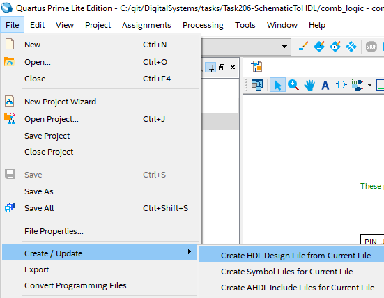
<figcaption>Converting a schematic to an HDL in Quartus</figcaption>
</figure>

| 4 | Select `Verilog HDL` (remember that SystemVerilog is backwards compatible with Verilog)|
| --- | --- |

<figure>
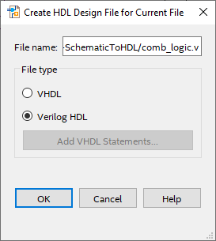
<figcaption>Converting a schematic to an HDL in Quartus</figcaption>
</figure>

| 5 | Identify the internal wires on the schematic |
| --- | --- |
| - | Open the generated file `comb_logic.v` |
| - | The output should be similar to the listing below (I have removed some whitespace) |

```verilog
// PROGRAM		"Quartus Prime"
// VERSION		"Version 20.1.1 Build 720 11/11/2020 SJ Lite Edition"
// CREATED		"Thu Sep 09 15:05:58 2021"

module comb_logic(
	KEY0,
	KEY1,
	LED0
);

input wire	KEY0;
input wire	KEY1;
output wire	LED0;

wire	SYNTHESIZED_WIRE_0;
wire	SYNTHESIZED_WIRE_1;
wire	SYNTHESIZED_WIRE_2;
wire	SYNTHESIZED_WIRE_3;

assign	SYNTHESIZED_WIRE_3 = SYNTHESIZED_WIRE_0 & KEY1;
assign	SYNTHESIZED_WIRE_2 = KEY0 & SYNTHESIZED_WIRE_1;
assign	LED0 = SYNTHESIZED_WIRE_2 | SYNTHESIZED_WIRE_3;
assign	SYNTHESIZED_WIRE_0 =  ~KEY0;
assign	SYNTHESIZED_WIRE_1 =  ~KEY1;
endmodule
```

There are a number of internal wires declared in this code:

```verilog
wire	SYNTHESIZED_WIRE_0;
wire	SYNTHESIZED_WIRE_1;
wire	SYNTHESIZED_WIRE_2;
wire	SYNTHESIZED_WIRE_3;
```

| - | Can you identify the position of these wires in the schematic? |
| - | - |
| - | Note how there is one internal wire for each logic-gate output. |
| - | (write it down, then hover the mouse over the `?` to check your answer) |

| Node | Wire |
| - | - |
| A | <p title="SYNTHESIZED_WIRE_0">?</p> |
| B | <p title="SYNTHESIZED_WIRE_1">?</p> |
| C | <p title="SYNTHESIZED_WIRE_3">?</p> |
| D | <p title="SYNTHESIZED_WIRE_2">?</p> |

<figure>
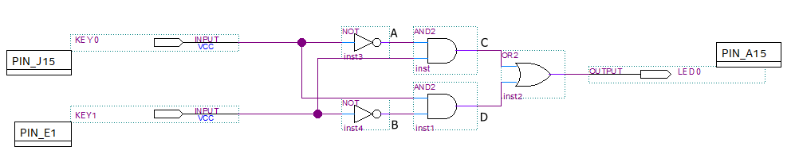
<figcaption>Internal wires labelled as A,B,C and D.</figcaption>
</figure>

Let's now look at how the module was declared:

```verilog
module comb_logic(
	KEY0,
	KEY1,
	LED0
);

input wire	KEY0;
input wire	KEY1;
output wire	LED0;
```

Note how a slightly different syntax is used to previous examples.

The wires `KEY0, KEY1` and `LED0` are the input and output signals to the `comb_logic` component, as presented to the outside world. The "type" is `wire` (other types exist in SystemVerilog as we will discover). Another way to write this is as follows:

```verilog
module comb_logic(input wire KEY0, input wire KEY1, output wire LED0);
```

As the first two are both inputs and type `wire`, you can write it more concisely as follows:

```verilog
module comb_logic(input wire KEY0, KEY1, output wire LED0);
```

Or even more concisely (not advised) the compiler can infer `wire`:

```verilog
module comb_logic(input KEY0, KEY1, output LED0);
```

Although all these styles are equivalent, being overly concise can become ambiguous to the reader (and thus can be frowned upon!). For this course, we will try and use the following **convention**:

```verilog
module comb_logic(output wire LED0, input wire KEY0, input wire KEY1);
```

In this convention, the *outputs are listed first*, and *every input / output has a type*. It is clear while still being more concise than the first example.

> **Note the following:**
>
> It is very helpful if HDL is written in a style that is unambiguous, but without being too verbose. Not only is it easier to understand, it is also easier to spot errors (bugs). As we will discover, SystemVerilog contains language constructs that help some of the common issues found in it's predecessor (and subset), Verilog.

The convention used in this course is as follows:

* The outputs are listed first
* All inputs and outputs are explicitly declared as an `input` or `output`
* All input and output **types** are explicitly declared (type `wire` in this case)
* For assessment purposes, you may be asked to conform to this convention
* Third party components may deviate from this

| 6 | Add the verilog file to your project |
| - | - |
| - | Add `comb_logic.v` to your project (`Project->Add Current File To Project...`) |
| - | Remove the schematic from the project (`Project->Add/Remote Files from Project...`). This is to avoid the confusion of two entities with the same name |

| 7 | Experiment - Test it is logically identical |
| - | - |
| - | Make `comb_logic.v` your top level entity (instead of the schematic) |
| - | Build and simulate with ModelSim. Use a Wave window to change the inputs and visualise the output |

<figure>
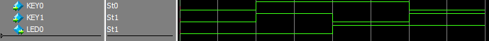
<figcaption>Check your simulation matches this</figcaption>
</figure>

| 8 | Experiment - Use a more concise module declaration |
| - | - |
| - |  modify the `comb_logic.v` to use a more concise declaration (as above) |
| - |  Don't forget to recompile! |
| - | Build and simulate with ModelSim to check it is logically unchanged. |

The simulation output should confirm this as an XOR gate (as shown above and in the video).

The internal logic is defined in the lines shown below. Each assignment describes a logic relationship that will ultimately be synthesised in hardware. In this case it is possible to infer the structure.

```verilog
assign	SYNTHESIZED_WIRE_3 = SYNTHESIZED_WIRE_0 & KEY1;
assign	SYNTHESIZED_WIRE_2 = KEY0 & SYNTHESIZED_WIRE_1;
assign	LED0 = SYNTHESIZED_WIRE_2 | SYNTHESIZED_WIRE_3;
assign	SYNTHESIZED_WIRE_0 =  ~KEY0;
assign	SYNTHESIZED_WIRE_1 =  ~KEY1;
```

| 9 | Experiment - Reorder assignments in the HDL |
| - | - |
| - | Change the order of the lines and show that the logic of the component is unchanged. |
| - | Use ModelSim to confirm your result |  
| - | Use the Quartus Netlist Viewer to confirm the synthesis is as expected |

## Task 207: Schematics and gate models

In the previous task, when we exported a schematic in Quartus, the tools chose to exclusively use *continuous assignment* (`assign`).  This would seem to make intuitive sense as all the logic in the schematic was limited to simple primitive operations (AND, OR, NOT). 

Such gates are pre-synthesised in the macro-cells of the FPGA, so it is not difficult to envisage how this might be synthesised in practice. However, I say *envisage* because we did not specify this - the decision was made by the development tools. The tools could equally implement the exact same logic using *gate models*.

Again, we remind ourselves about the two lowest-level styles of SystemVerilog:

> * *continuous assignment* is somewhat *abstracted* from the physical hardware. It describes logical relationships, but not the gates as such (although the relationship may be apparent). This is sometimes called the dataflow style.
>
> * *gate models* are a low-level description of which hardware to use and how it should be connected. It ia the closest to a one-to-one mapping of HDL onto hardware.

> All circuits could ultimately be built with either style, or a combination of the two. As we will cover later however, behavioural styles are much more expressive and concise, but we need to be careful. Because it is so abstracted from the hardware, subtle mistakes and inefficiencies can be made.

In practise, a mix of styles can be used. For example, *gate models* are important as they allow us to "place and connect" other components within a larger design. This is illustrated in the next task.

| Task | - |
|--- |---|
| 1 | Open the Quartus project `Task207-SchematicToHDL` and build the project|
| 2 | If not already visible, open the schematic `comb_logic` |
|  | You should see a schematic similar to the figure below |


<figure>
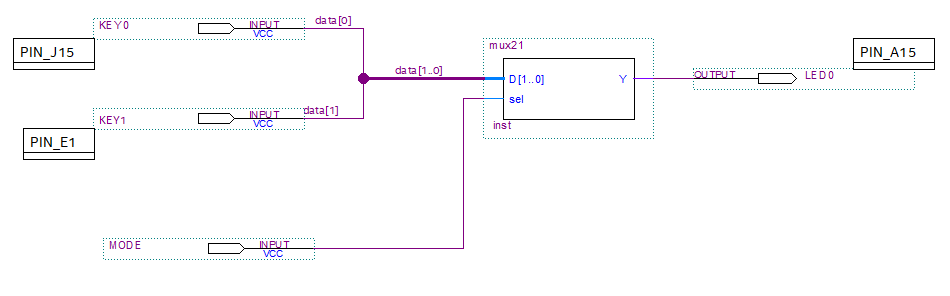
<figcaption>Circuit that embeds another (multiplexer)</figcaption>
</figure>

| 3 | Right-click the `mux21` component and choose "Open Design File" |
| - | - |
| - | You should observe the following Verilog file opens |

```verilog

module mux21( output wire Y, input wire [1:0] D, input wire sel);

	assign Y = D[sel];
	
endmodule
```

Notice the input `D` is no longer a single wire, but 2 wires (bits 1 down to 0) written as `D[1:0]`. 

Make a note of the names of the inputs and outputs (you can also see them on the schematic). The top level schematic contains a single *instance* of the `mux21` component. The definition for this component is in `mux21.sv`.

> In the physical world, if we were to solder a component to a Printed Circuit Board, then it would an instance of that chip type.

| 4 | Export the top level schematic as a verilog file. |
| --- | --- |
| - | Look closely at the output. You should see something similar to the code below |

```verilog
module comb_logic(
	KEY0,
	KEY1,
	MODE,
	LED0
);

input wire	KEY0;
input wire	KEY1;
input wire	MODE;
output wire	LED0;

wire	[1:0] data;

mux21	b2v_inst(
	.sel(MODE),
	.D(data),
	.Y(LED0));

assign	data[1] = KEY1;
assign	data[0] = KEY0;

endmodule
```

We can see the verilog equivalent of component placement in this HDL script:

```verilog
mux21	b2v_inst(
	.sel(MODE),
	.D(data),
	.Y(LED0));
```

Note the following:

* The type of component is `mux21`, which is a 2-1 multiplexer
* The instance name is `b2v_inst`. 
* The labels `sel`, `D` and `Y` are the names of the multiplexer's input and output ports.
* The input and output ports are connected to the signals `MODE`, `D` and `LED0` (external to the multiplexer component).

You can have multiple instances of a component, but each must have a unique instance name.

## Task 209: Introduction to Testbenches
Testing during the development of HDL components is absolutely essential. No component you write has any value until there is evidence of correct functionality.

So far, we have tested logic components using ModelSim interactively. This is useful for exploration, but can easily become tedious and slow down development. It is certainly not the way we should proceed when we begin formal testing and quality assurance.

It is very common practise to automate testing by writing what is referred to as a **Testbench**. Interesting, it is usual to create a testbench using more HDL.
Let us look at an example that illustrates the concept.

The **component under test** is our now-familiar xnor gate `uop_nxor.sv`:

```verilog
module uop_nxor (output wire Y, input wire A, input wire B);

//Internal wires
wire term0;
wire term3;

//Continuous Assignment (order does not matter)
assign Y = term0 | term3;
assign term0 = ~A & ~B;
assign term3 = A & B;

endmodule
```

We could now create another SystemVerilog file, `uop_nxor_tb1.sv` to create an instance of `uop_nxor` and **exhaustively test** it. 

| Task 209 | Testbench |
|--- |---|
| 1 | Open the Quartus project `Task209-TestBench` and build the project|
| 2 | Launch ModelSim by selecting Tools->Run Simulation Tool->RTL Simulation |
| 3 | In the `work` library, right-click `uop_nxor_tb1` and click Edit |
| - | Read the code and comments carefully. |
| 4 | Now run a simulation and view all signals on the waveform |

Note how the testbench generates all the input stimuli for you using SystemVerilog. So yes, *we are using Systemverilog to test Systemverilog*. In this example, you still need to inspect the waveform to confirm correction functionality. Later we will see how we can automate much of the testing.

The testbench code is shown below. 

```verilog
// Testbench has no inputs or outputs
module uop_nxor_tb1;

//Internal signals
reg aa;
reg bb;
reg yy;

//Instantiate a xnor gate using a structural style
uop_nxor u1 (yy, aa, bb);

// Note how the signals yy, aa and bb are connected to the output and inputs of u1

// *********************************
// This HDL works in simulation only
// *********************************

initial	//Similar to always block, starting at time t=0 (use for sim only)
begin

	//Stimulate the aa and bb signals and manually observe the change in yy

   aa = 1'b0;	// 1'b0 => 1 bit wide, binary, value 0
   bb = 1'b0;
   #50ps;		// Simulate 50ps delay
   aa = 1'b0;
   bb = 1'b1;	// 1'b1 => 1 bit wide, binary, value 1
   #50ps;
   aa = 1'b1;
   bb = 1'b0;
   #50ps;
   aa = 1'b1;
   bb = 1'b1;
   #50ps;
   $display("DONE");	// Similar to printf.

end

endmodule
```

### Unit Under Test
Our objective is to test a component to prove it is functionally correct. The physical analogy of a testbench is as follows:

* Place the component to be tested
* Connect wires to the inputs and outputs
* Stimulate the input wires 
* Check the output wires

When we *place* a component, we say we *instantiate* it. You can have multiple *instances* of a component. Each has a label, just as you would on a schematic. This is one of the occasions where structural (gate level) HDL is needed:

```verilog
uop_nxor u1 (yy, aa, bb);
```

`uop_nxor` is the gate type (name of another module); `u1` us the instance label; `(yy, aa, bb)` connects the test wires.

### Initial Block
Next, we see the `initial` block, along with `begin` and `end` delimiters. Like `always`,  code between the delimiters is **procedural** (i.e. the sequence matters). The approach is then to apply changes to the `aa` and `bb` signals, **allow some time to pass**, then observe the output signal `yy`.

```verilog
   aa = 1'b0;	// 1'b0 => 1 bit wide, binary, value 0
   bb = 1'b0;
   #50ps;		// Simulate 50ps delay
```

It is important to understand that changing a signal has no immediate effect. Whether real or simulated, time must be allowed to pass for changes to take effect. In the case of simulation, this is a very small time quantum.

Note how delays are implemented:

```verilog
#50ps;
```

You can also write a delay as part of a statement, such as:

```verilog
#50ps $display("DONE");
```

Without delays, there is no time to see the consequence of any actions. `$display` is a *system function* that performs similar tasks to the well-known `printf` in C and C++. 

Also note that you cannot modify a `wire` within a procedural block. It must be type `reg` or (in SystemVerilog) `logic`.

### Numeric Literals
You may have observed that `aa=1'b1` was written instead of writing the shorter form `aa=1`. Both are valid in this case, but sometimes it is important to be more explicit.

The format is:
```
<size>'<signed><radix>value
```

Items in \<angle brackets\> are optional

`size` is the number of bits. The default is 32 bits 

`<signed>` is `s` or `S` to indicate signed values. The default is unsigned.

`radix` is one of the following: 

* **b** - Binary
* **d** - Decimal (default)
* **h** - Hexadecimal
* **o** - Octal

So for example:

* `4'b1010` is a 4-bit value, specified in binary with the value `1010`
* `4'b10` is a 4-bit value, specified in binary with the value `0010`
* `8'd7`  is `00000111` in binary
* `8'h1F` is `00011111` in binary

You can also add spaces to binary numbers to make them more readable:

```verilog
$display("%x", 12'b 1010_1111_0001);
```

would display `AF1`.

| 5 | Edit the testbench `uop_nxor_tb2`  |
|- |-|
| - | Note how concatination is used to make the HDL more concise |

Concatination can be used on either side of an assignment. For example:

```verilog
{aa,bb} = 2'b01;
```

`aa` is set to 0 and `bb` is set to 1. `{aa,bb}` is 2 bits wide, with `aa` as the most significant bit.

| 6 | Edit the testbench `uop_nxor_tb3`  |
|- |-|
| - | Note again how concatination is used to make the HDL more concise |

In this example, a new 2-bit signal is created:

```verilog
reg [1:0] mt;
```

Note the square brackets to determin the range of bits (left to right, from bit 1 to 0). Then *inside* the initial block, the following continuous assignment is made:

```verilog
assign {aa,bb} = mt;	
```

Now any change to `mt` will immediately change `aa` and `bb`. This allows the mintern to be expressed in decimal (e.g. `mt = 3`).

| 7 | Finally, edit the testbench `uop_nxor_tb4`  |
|- |-|
| - | Read the comments and note the assert command |
| 8 | Build and run this testbench |
| 9 | Now to demonstrate the use of this, edit the component and add an error on purpose |
| - | Edit `uop_nxor.sv` |
| - | For `term0`, delete one of the not operators `~` | 
| - | Recompile and test with the testbench `uop_nxor_tb4`|
| - | Note the error messages |


Here we see the all-important `assert` command being used. Note how error messages can be displayed without the need to visually check any waveforms. You can also use waveforms, and if you double-click and error, ModelSim will jump to the location.

## Task 210: Data Word Manipulation

We briefly met concatination in the section on testbenches. The manipulation of signals is quite elegant in SystemVerilog. Key to this are two further types:

* **Packed Arrays** - arrays of bits that make up an N-bit word.
* **Unpacked Arrays** - a convention array of words or bits, similar to a memory.

### Packed Arrays
Very often, a component will have inputs, intermedtiate states and outputs that are N-bits wide, where N≥2.

For example, an 8-bit signal could be declared as follows:

```verilog
wire [7:0] data;
```

or alternatively in SystemVerilog:

```verilog
logic [7:0] data; 					
```

This *packed array* can be assigned an 8-bit number. For following three statements **all produce the same result**:

```verilog
data = 8'b10101100;
data = 8'hAC;
data = 8'd172;
```

Another way is to concatenate two values using the `{` and `}` braces:

```verilog
data = {4'hA, 4'hC};
```

You can concatenate the left hand side as well. For example:

```verilog
logic [7:0] databyte; 				//Packed Array 
logic [3:0] datanibble;				//Packed array
...
{databyte, datanibble} = 12'b111101010011;
```

This way, `databyte` is `11110101` and `datanibble` is `0011`.

For clarity we can also write:

```verilog
{databyte, datanibble} = 12'b11110101_0011;
```

there the `_` character provides a visual break in the number to help us read it.

You can also extract sub-slices of larger data words. For example, to extract bits 2..5 you could do the following:

```verilog
databyte = 8'b10101100;
datanibble = databyte[5:2];
```

so `datanibble` would be equal to `1011`. What is not permitted is the following:

```verilog
datanibble = databyte[2:5];
```

as the directions must match. As you can hopefully see, bit manipulation in SystemVerilog is very concise and easy to perform.

### Unpacked Arrays
It is useful top contrast the above with *unpacked arrays*. These are similar to an array you might encounter in the C and C++ programming languages.

For example, to create an array of single 1-bit values, you could write:

```verilog
logic arrayOfBits [7:0];			//Unpacked Packed array of bits
```

We can set each bit using the square brackets `[ ]`. For example:

```verilog
arrayOfBits[0] = 1;	//Set array element 0
arrayOfBits[1] = 0;	//Set array element 1
arrayOfBits[7:0] = {1, 0, 1, 0, 1, 1, 0, 1};	//Set elements 7 down to 0
```

what you **cannot** do is this:

```verilog
arrayOfBits[7:0] = 0;		//ERROR
```

We can also have arrays of N-bit words (packed arrays)

```verilog
logic [3:0] arrayOfNibbles[7:0];	//Unpacked array of 4-bit values
```

We can set values in this array again using square brackets:

```verilog
arrayOfNibbles[0] = 4'b0100;
arrayOfNibbles[7:0] = { 4'd1,  4'd2,  4'd3,  4'd4, 4'hA, 4'hB, 4'hC, 4'hD };
arrayOfNibbles[7:4] = { 4'd1,  4'd2,  4'd3,  4'd4 };
arrayOfNibbles[3:0] = { 4'hA,  4'hB,  4'hC,  4'hD };
```

Unpacked arrays can be thought of as blocks of memory.

*Now it is your turn!*

| TASK 210 | |
| - | - |
| 1 | Using ModelSim, change the directory to the folder `Task210-SignalManipulation` |
| 2 | Compile the file `task210.sv` |
| 3 | Read the comments in this file and attempt the "single line challenges" |
| 4 | Build and simulate `task210.sv`. Check the output to see if your solutions work |
| - | Solutions can be found in `solutions.sv` in the same folder |

**Notes:**

* `task210.sv` is actually testbench. It cannot be synthesised, and is only for testing. The style of SystemVerilog is behavioural.
* `assert` was used to check the answers. This was made more concise by invoking as `task`. We will meet tasks again later in the course.

## Challenges
Here are some challenges for you to try to re-enforce the content in this section.

**1** Create a SystemVerilog module to implement the following combinational logic using continuous assignment (dataflow style). Do not attempt to simplify the logic.

| A | B | C | | Y |
| - | - | - | - | - |
| 0 | 0 | 0 | | 0 |
| 0 | 0 | 1 | | 0 |
| 0 | 1 | 0 | | 1 |
| 0 | 1 | 1 | | 1 |
| 1 | 0 | 0 | | 1 |
| 1 | 0 | 1 | | 1 |
| 1 | 1 | 0 | | 0 |
| 1 | 1 | 1 | | 0 |

**2** Create a testbench to exhaustively test (1). Show the results on a waveform.

**3** Create a systemverilog module to implement the following combinational logic using **gate level HDL**. Do **not** attempt to simplify the logic.

| A | B | C | | Y |
| - | - | - | - | - |
| 0 | 0 | 0 | | 0 |
| 0 | 0 | 1 | | 0 |
| 0 | 1 | 0 | | 1 |
| 0 | 1 | 1 | | 0 |
| 1 | 0 | 0 | | 0 |
| 1 | 0 | 1 | | 1 |
| 1 | 1 | 0 | | 0 |
| 1 | 1 | 1 | | 0 |

**4** Create a testbench to exhaustively test (3). Use the assert command to automatically test the output.

**5** Add 5ps delay to the output of **every** gate used in (3). Add two more tests to the testbench in (4) that apply the following input sequence: 

```verilog
{A,B,C}=3'b010;
#100ps; 			//a delay of 100ps
{A,B,C}=3'b101;
#100ps;
```

**5** Show the result in a wave window. What did you expect the output `Y` to show and explain any differences.

If written correctly, you should see an output similar to the figure below:

<figure>
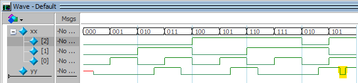
<figcaption>Showing a static hazard (highlighted in yellow) caused by internal delays in a component</figcaption>
</figure>

**This is such a fundamental issue, it deserves further analysis**

In an ideal world, the following would describe the transitions of all the signals. 

| t | A | B | C | | Y |
| - | - | - | - | - | - |
| 0ps | 0 | 1 | 0 | | 1 |
| | ↓ | ↓ | ↓ | |
| 100ps | 1 | 0 | 1 | | 1 |

Indeed, this reflects the steady state, but *not the intermediate states*. Instead, we can draw another truth table, including the outputs of all gates as they change at different times. 

| t    | A | B | C |   | ~A | ~B | ~C | m2 | m5 |   | Y |
| -    | - | - | - | - | -  | -  |  - | -  | -  | - | - |
| 0ps  | 0 | 1 | 0 |   |  1 |  0 |  1 |  1 |  0 |   | 1 |
|      | ↓ | ↓ | ↓ |   |    |    |    |    |    |   |   |
| 5ps  | 1 | 0 | 1 |   |  1 |  0 |  1 |  1 |  0 |   | 1 |
|      |   |   |   |   |  ↓ |  ↓ |  ↓ |  ↓ |    |   |   |
| 10ps | 1 | 0 | 1 |   |  0 |  1 |  0 |  0 |  0 |   | 1 |
|      |   |   |   |   |    |    |    |    |  ↓ |   | ↓ |
| 15ps | 1 | 0 | 1 |   |  0 |  1 |  0 |  0 |  1 |   | 0 |
|      |   |   |   |   |    |    |    |    |    |   | ↓ |
| 20ps | 1 | 0 | 1 |   |  0 |  1 |  0 |  0 |  1 |   | 1 |

We can see this on the timing diagram below:

<figure>
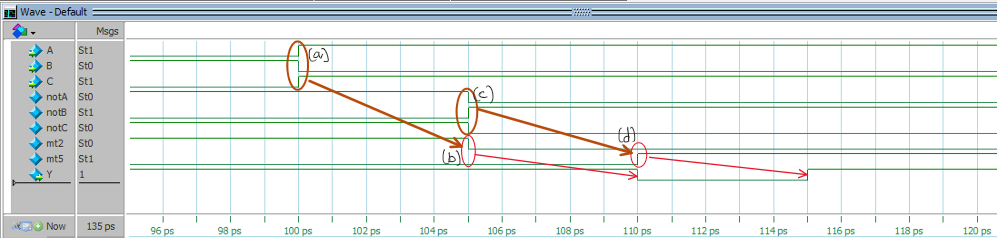
<figcaption>Showing the evolution of the static hazard caused by internal delays in a component</figcaption>
</figure>

(a) Inputs change

(b) Minterm m2 changes as a consequence of (a)

(c) Inverter outputs change as a consequence of (a)

(d) Minterm m5 changes as consequence of (c)

We also see the output `Y` (a function of the minterms) change in reaction to (b) and (d).

* It takes 15ps to resolve a steady-state of `Y`.  
* During this 15s interval, Y changes twice

In conclusion, we cannot trust the outputs of combinational logic until it has reached its steady state. This is a key motivation to use synchronous logic. Synchronous logic used a clock edge to update inputs and sample outputs at fixed intervals. The internal propagation delays limit how fast such a clock can switch.

## Reflection
From the exercises in the previous tasks, there are some key points:

* A schematic can easily be converted to HDL. 
* This is typically continuous assignment or a netlist of gate models. 
* Components (usually written with a HDL ) can be instantiated and connected using gate level HDL
* Data flow style HDL defines logical relationships. We often use *continuous assignment* which 
* For real synthesised logic, the output of combinational logic can produce spurious results until a stead-state has been reached.

## References

See [References](references.md) for a list of numbered references in this course.

[EDAPlayground]: https://www.edaplayground.com/

[SysVerilogOperators]: https://www.fpgatutorial.com/systemverilog-operators/

[Verilog]:   https://en.wikipedia.org/wiki/Verilog

[SysVerilog]: https://en.wikipedia.org/wiki/SystemVerilog