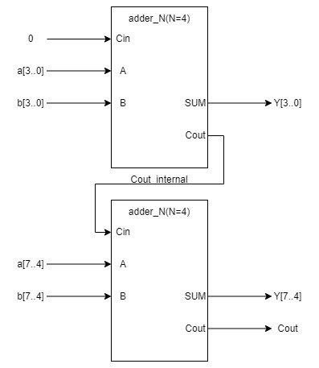
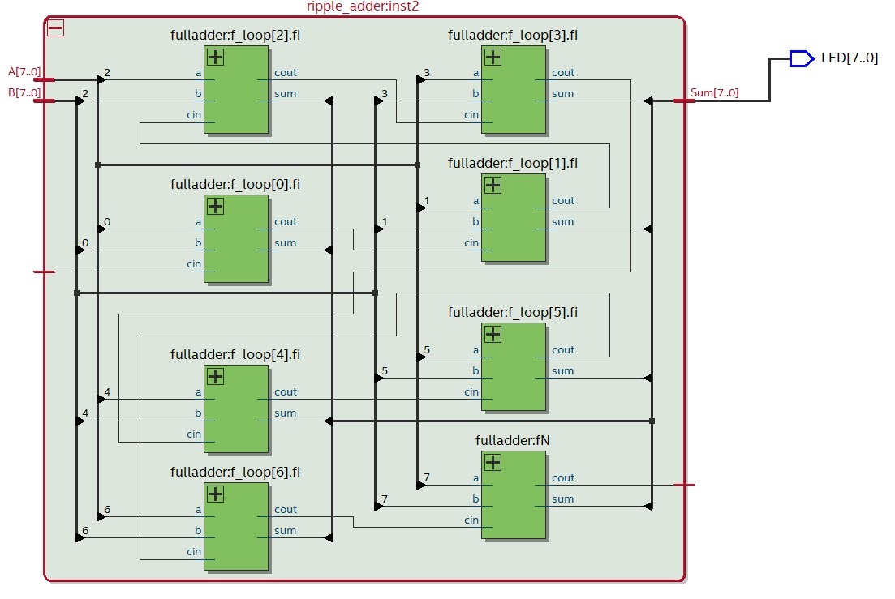
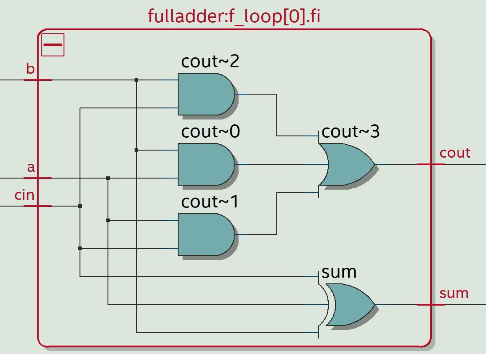
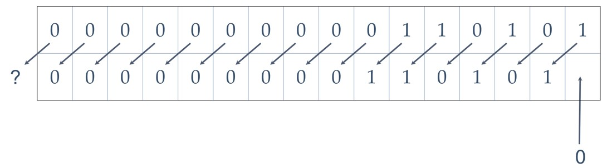
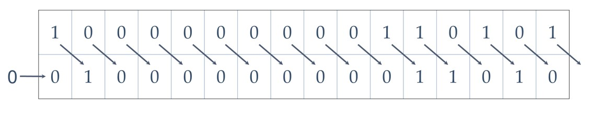
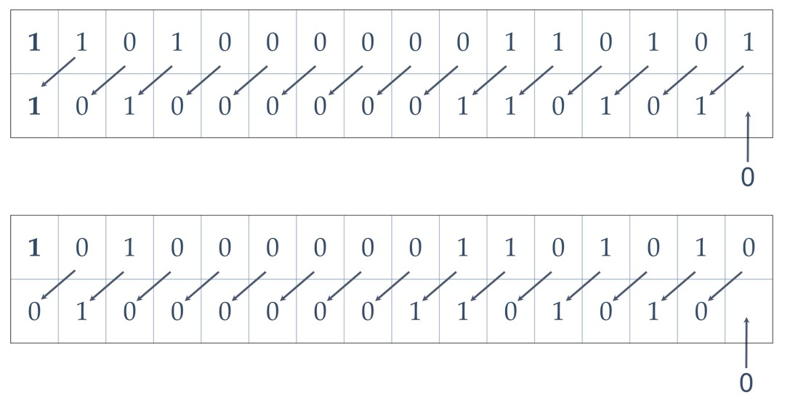
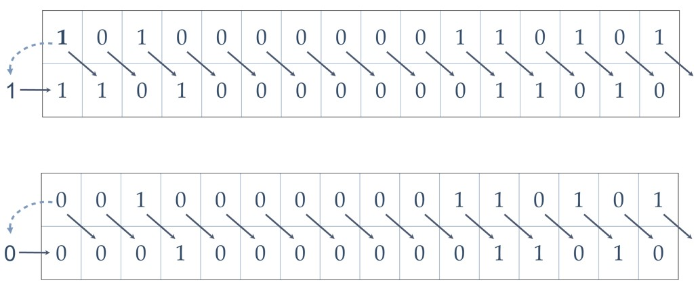
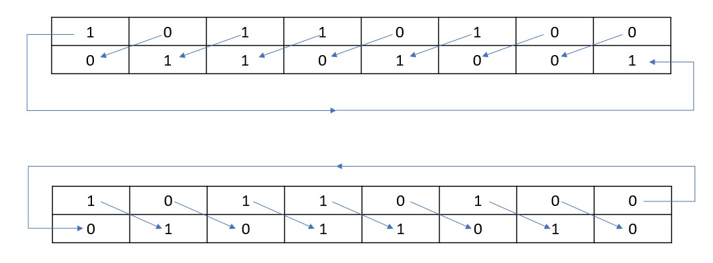
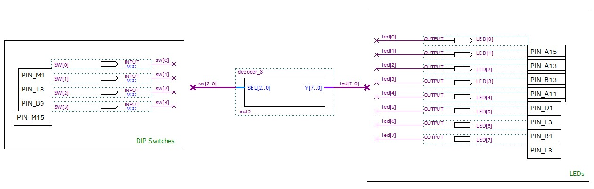
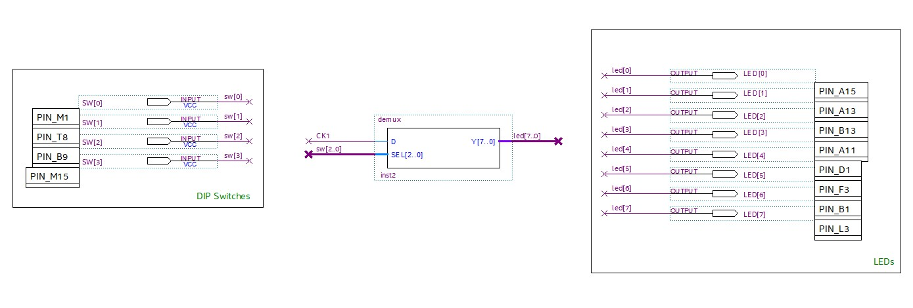

[Back](../README.md)

---

<figure>

</figure>

# Combinational Logic Components

In this section, we will further our exploration of the SystemVerilog language by building some common combinational logic circuits.

This practical session is designed to be standalone. However, chapter 4 in [1] will compliment it as supplementary reading.

| TABLE OF CONTENTS |
| - |
[Intended Leaning Outcomes](#Intended-Learning-Outcomes)
[Combinational Logic](#)
[Task 215: 2-1 Multiplexer](#Task-215-Multiplexer)
[Task 216: N-to-1 Multiplexer](#Task-216-N-to-1-Multiplexer)
[Task-218: Addition](#Task-218-Addition)
[Task-220: Shift and Rotate](#Task-220-Shift-and-Rotate)
[Task-222: Multiply and Divide](#Task-222-Multiply-and-Divide)
[Task-224: Decoders](#Task-224-Decoders)
[Task-225: Demultiplexers](#Task-225-Demultiplexers)
[Task-226: Encoders](#Task-226-Encoders)
[Challenges](#Challenges)
[Reflection](#Reflection)
[References](#References)

## Intended Learning Outcomes

By the end of this section, you should be able to:

* Create and test a generic N-to-1 multiplex using different styles of SystemVerilog
* Create and test components with tri-state outputs
* Generate multiple instances of a component using the `generate` statement
* Use don't care inputs to simplify a HDL design
* Perform arithmetic operations in SystemVerilog
* Create and test generic encoders and decoder objects in SystemVerilog
* Evaluate the gate cost of synthesising combinational logic devices for an FPGA
* Write and test SystemVerilog tasks and functions to reduce repetition in HDL

## Combinational Logic
In the previous section, we looked at creating components in SystemVerilog. We specifically focused on combinational logic. All digital systems contain combinational logic.

The basic building blocks of digital electronics are fundamental gates, including AND, OR, NOT, XOR etc. However, as our designs scale up in complexity, it is usually to use other building blocks, including encoders, decoders, multiplexers, demultiplexers and arithmetic functions.

To build on and reinforce what we learned in the previous section, we will now look at examples of combinational building blocks. Some new concepts and techniques are also introduced, including the use of don't care inputs and high-impedance outputs.

## Task-215 Multiplexer

The figure below shows a simple 2-to-1 multiplexer:

<figure>
<center>

<figcaption>2-to-1 multiplexer, with input signals A and B, select signal S and output OUT</figcaption>
</center>
</figure>

The output of the device is equal to the selected input. Only one input can be selected, and is selected with the select line `S`.

* When `S == 0`, then `OUT = A`
* When `S == 1`, then `OUT = B`

It is a fundamental yet simple device, which is easily created in SystemVerilog in a number of ways:

Using behavioural HDL, we might create a 2-to-1 multiplexer as follows:

```verilog
module mux2_behavioural_v1 (output logic out, input logic a, b, s);

always_comb
	if (s == 0)
	   out = a;	//Single line does not need begin
	else
	   out = b;

endmodule
```

Note there is no reference to `AND`, `OR` or `NOT` gates. There is no Boolean logic either. We use behavioural constructs to *describe* the behaviour.

As a reminder, you may with to first watch this video:

[VIDEO - Compiling and testing the mux in ModelSim](https://plymouth.cloud.panopto.eu/Panopto/Pages/Viewer.aspx?id=2ebf2fe1-3f58-4ed1-bdd7-ae2000f11e08)

Now replicate by following the steps below:

| Task 215 | 2-to-1 Multiplexer |
| - | - |
| 1 | Run ModelSim, and change directory to `Task215-2-to-1-multiplexer` |
| 2 | Compile `mux2_behavioural_v1.sv` |
| 3 | Compile and simulate the testbench `mux2_behavioural_v1_tb.sv` |

Read through both files and check you can follow what is being performed. You may want to check back to the [previous lab](comb_logic.md) if you need to review.

Now to see this working in real hardware, watch the following video:

[VIDEO - Testing the mux with Quartus and an FPGA](https://plymouth.cloud.panopto.eu/Panopto/Pages/Viewer.aspx?id=7b658b84-708e-44a1-a6e1-ae2000e32a60)

Now replicate by following the steps below:

| Task 215 | Continued |
| - | - |
| 4 | Open the Quartus Project in Task-215 |
| 5 | Add `mux2_behavioural_v1.sv`  to the project |
| 6 | Create a symbol file for this component |
| 7 | Add the component to the top-level schematic |
| 8 | Use `Key0` to route either `CK1` or `CK2` to `LED[0]` |
| - |

Check that you get the same result as in the video.

We can use other styles of SystemVerilog to achieve the same result. Some examples are given below:

### Variation 2
The same type, but using `begin` and `end` in our if-statement so that addition lines could be added.

```verilog
module mux2_behavioural_v2 (output logic y, input logic a, b, s);
always_comb
	if (s) begin
	   y = b;	//Single line does not need begin
	end
	else begin
	   y = a;
    end
endmodule
```

### Variation 3 - `switch-case`

The variation below uses a `switch-case` to choose the output.

```verilog
module mux2_behavioural_v3 (output logic y, input logic a, b, s);
always_comb
	case (s)
		0 : begin
		   y = a;
		end
	
		1 : begin
		   y = b;
		end
	
		default : begin
		   y = 1'b?;
		end
	endcase
endmodule
```

### Variation 4 - continuous assignment

Another option is to use the dataflow style and continuous assignment:

```verilog
module mux2_dataflow (output logic y, input logic a, b, s);

assign y = (s == 0) ? a : b;

endmodule
```

### Variation 5 - Gate Level

We can easily design and build a multiplexer from gates. The truth0table for a 2-1 mux is as follows (assuming A is the upper input):

| S | A | B | Y |
| - | - | - | - |
| 0 | 0 | 0 | 0 |
| 0 | 0 | 1 | 0 |
| 0 | 1 | 0 | 1 |
| 0 | 1 | 1 | 1 |
| 1 | 0 | 0 | 0 |
| 1 | 0 | 1 | 1 |
| 1 | 1 | 0 | 0 |
| 1 | 1 | 1 | 1 |
| - | 

| Task 215 | Continued |
| - | - |
| 9 | Write the Boolean equation for `Y` in terms of `A`, `B` and `S` |
| 10 | Simplify where possible |
| 11 | Sketch the schematic |
| 12 | Edit the (incomplete) component `mux2_structural.sv` in ModelSim |
| 13 | Starting with the HDL provided (and shown below), complete the component using the **structural** style |
| - | A solution `mux2_structural-solution.sv` is provided in case you get stuck |


```verilog
module mux2_structural (output logic y, input logic a, b, s);

// Write HDL here

endmodule
```

You now have 5 variations of the 2-to-1 multiplexer. A testbench has been created to compare them all

| Task 215 | Continued |
| - | - |
| 14 | Read, compile and run the testbench `mux2_tb.sv` to check your gate level component works |
| - | If you get an error, it is likely you made an error in (13) |
| - | If you cannot get it working, take a look in `mux2_structural-solution.sv` |

We have spent some considerable time looking at different ways to implement a simple 2-to-1 multiplexer. The style you choose may depend on what you feel most confident with. A general principle is to write in the clearest form first (typically behavioural). Once tested, you might consider re-writing in a less abstracted form which can be optimised<sup>**</sup> in some sense (maybe for speed, or space). You can then compare the outputs as we did in (14).

<sup>**</sup>It is unlikely that something as simple as a 2-to-1 multiplexer can be further optimised.

## Task 216 N-to-1 Multiplexer

Let's now scale up our multiplexer design to have 4 inputs. To select which of the 4 inputs to route to the output, we need `log`<sub>2</sub>(4)=2 select lines.

> If we have 2 select lines, `S` can present the four binary values 00, 01, 10, 11 (0..3 decimal)

Another way to view this is that if we have M select lines, we can choose 2<sup>M</sup> inputs.

We could extend what we did with the 2-to-1 multiplexer:

```verilog
module mux4_behavioural_v1 (output logic out, input logic a, b, c, d, logic [1:0] s);

always_comb
	if (s == 0)
	   out = a;	//Single line does not need begin
	else if (s == 1)
	   out = b;
	else if (s == 2)
	   out = c;
	else
	   out = d;

endmodule
```

| Task 216 | N-to-1 Multiplexer |
| - | - |
| 1 | Change directory to `Task216-N-to-1-multiplexer`|
| 2 | Build `mux4_behavioural_v1.sv`. Read the source and comments|
| 3 | Build the testbench `mux4_behavioural_v1_tb.sv`. Again read the source and comments |

Let us look at the testbench for this component:

```verilog
module mux4_behavioural_v1_tb;

//Internal signals for testing
logic y1, aa, bb, cc, dd;
logic [1:0] ss; //2 bit signal

//Instantiate the component under test
mux4_behavioural_v1 u1(y1, aa, bb, cc, dd, ss);


initial
begin
	//Unpacked array of expected (correct) outputs. Automatic means this has local scope
	automatic logic expected[4] = {1'b1, 1'b0, 1'b1, 1'b1};

	//Set inputs
	{aa, bb, cc, dd} = 4'b1011;

	//Iterate over all input sequences
	for (int n=0; n<4; n = n + 1) begin
		//Set the select line
		ss = n;

		//Add a delay so that the outputs update
		#10ps;

	    //Check output is the expected value
    	assert (y1 == expected[n])
            //Note how $display and $error can be used much like printf in C
           $display("Passed test %d, output=%d, expected=%d", n, y1, expected[n]);
        else
            $error("Error for test %d: expected %d and got %d", n, expected[n], y1);		
	end
end
endmodule
```

Some points to note:

* The output is compared with a value stored in the **unpacked array** `expected`.
   * Note the position of the square brackets
   * The method of obtaining the expected output must be calculated using same algorithm as the component. *By simply looking up the expected value, we avoid this (common) mistake*.
* The testbench is now longer than the component. This is not unusual.
* The `assert` function supports placeholders like `printf` in C.
* Any signal declared within the `initial` block must to be qualified as either `automatic` or `static`.
   * We will almost always use `automatic`
   * Did you know that in C and C++, this is also the case for local variables? The difference is that `automatic` is assumed unless you write `static`.

Now try to modify the testbench.

| Task 216 | continued |
| - | - |
| 4 | Try different values for (`aa, bb, cc, dd`) and rerun the test. Don't forget to update the expected values in the array |

So far, the two multiplexers have been fixed in size. This might be fine for 2 or 4 inputs, but what if we later wanted 64 inputs? Using the approach above, we will end up with very long and tedious components.

A improvement is to use a *packed array*. We can rewrite the above as follows:

```verilog
module mux4_behavioural_v2 (output logic out, input logic [3:0] x, logic [1:0] s);

always_comb
	if (s == 0)
	   out = x[0];	//Single line does not need begin
	else if (s == 1)
	   out = x[1];
	else if (s == 2)
	   out = x[2];
	else
	   out = x[3];
endmodule
```

| Task 216 | continued |
| - | - |
| 5 | Compile both `mux4_behavioural_v2.sv` and `mux4_behavioural_v2_tb.sv` |
| 6 | Read through the testbench and then run to check all tests pass |
| 7 | Now change the component to the following code and retest |

```verilog
module mux4_behavioural_v2 (output logic out, input logic [3:0] x, logic [1:0] s);
   assign out = x[s];
endmodule
```

The previous version was much shorter. As `x` is a packed array, we can reference each bit using the square brackets.

This is still a fixed sized multiplexer of course, but now it is simple to parametrize our component to make it generic. We want a single N-to-1 multiplexer component, where N &geq; 2.

```verilog
module muxN #(parameter N=4) (output logic out, input logic [N-1:0] x, logic [$clog2(N)-1:0] s);

 assign out = x[s];

endmodule
```

Note the default parameter value for `N` is set to 4. 

| Task 216 | continued |
| - | - |
| 8 | Compile both `muxN.sv` and edit to confirm it matches the code above |
| 9 | Using the code in `mux4_behavioural_v2_tb.sv` as a starting point, create a new testbench `muxN_tb.sv` and adapt it to test an 8 input MUX. |
| - | You will need to instantiate an instance of `muxN` for `N=8` |
| - | The input value for `x` should be 10101100 |
| - | A solution `muxN_tb-solution.sv` is provided if you get stuck |

## Task-218 Addition

One of the most useful features of FPGAs is the ability to perform arithmetic, often in parallel. Some of the core arithmetic operations can be performed with combinational logic. We will look at some of these now.

A simple N-bit adder can be created using behavioural HDL.

```verilog
module adder_N #(parameter N = 4) (Sum, Cout, A, B, Cin);

//Use the more 'vertical' syntax to fit on the page
output logic [N-1:0] Sum;
output logic Cout;
input logic [N-1:0] A, B;
input logic Cin;

always_comb
	{Cout, Sum} = A + B + Cin;

endmodule
```

Here we rely on the `+` operator to add packed arrays using 2's compliment arithmetic. We do not specify any Boolean algebra or gates in the design.

| Task 218 | Arithmetic |
| - | - |
| 1 | In ModelSim, change the directory to `task-218` |
| 2 | Compile both `adder_N.sv` and `adder_N_tb.sv` |
| 3 | Simulate  the testbench. Include a waveform output |
| 4 | Now watch the following video and replicate what is shown |
|   | [VIDEO: Grouping and Combining Signals in ModelSim](https://plymouth.cloud.panopto.eu/Panopto/Pages/Viewer.aspx?id=7283f239-1908-4a10-84c9-ae21010eb42b) |
| 5 | Write an additional testbench `adder_8_tb.sv` to test an 8-bit adder built from two cascaded 4-bit adders (as shown in the figure below) |
| - | Instantiate 2x 4-bit adders and use the structural style to connect `Cout` to `Cin` | 
| - | A solution is provided in `adder_8_tb-solution.sv` |

<figure>

<figcaption>Cascading two 8-bit adders to build a 16-bit adder</figcaption>
</figure>

### Ripple Adder

You may recall a device known as a ripple-adder. This applies the concept shown in the previous example, only using one-bit adder circuits. A simple one-bit adder, or *full adder* as it is known, can be built as follows:

```verilog
//From Chapter 3 [1]
module fulladder (output logic sum, cout, input logic a, b, cin);
always_comb
begin
	sum = a ^ b ^ cin;
	cout = a & b | a & cin | b & cin;
end
endmodule
```

We can then cascade an arbitrary number of these using the `generate` statement:

```verilog
//Adapted from example in the book by Mark Zwolinski (see chapter 3 of [1]])
module ripple_adder #(parameter N = 4) 
                     (output logic [N-1:0] Sum, 
				      output logic Cout, 
				      input logic [N-1:0] A, B, 
				      input logic Cin);
	
	logic [N-1:0] Ca;
	assign Ca[0] = Cin;

	genvar i;
	generate for (i = 0; i < N-1; i++) 
		begin : f_loop
			fulladder fi (Sum[i], Ca[i+1], A[i], B[i], Ca[i]);
		end
	endgenerate

	//msb
	fulladder fN (Sum[N-1], Cout, A[N-1], B[N-1], Ca[N-1]);
endmodule
```

| Task 218 | continued |
| - | - |
| 6 | Modify `adder_N_tb.sv` to simultaneously test the ripple adder |
| - | Make sure you instantiate the rippled adder and give it separate outputs |
| - | Check that the output of the rippled adder is the same as the `adder_N` component |

You can see the impact of the `generate` statement when a component is added to a design in Quartus (Tools->Netlist Viewers->RTL Viewer).

If you instantiate an 8-bit ripple adder, the following is created: 

<figure>

<figcaption>Showing the Quartus RTL Viewer for the Ripple Adder </figcaption>
</figure>

You can see how the `generate` statement has replicated the full-adder component 8 times. Note the instance name for each one. Drilling down into one of the full adders, we see the following:

<figure>

<figcaption>Showing the Quartus RTL Viewer for the Full Adder </figcaption>
</figure>


## Task-220 Shift and Rotate
Shift and rotate are common operations performed on binary numbers (packed arrays in the case of SystemVerilog).

### Shift

The shift is commonly used to scale a value by a power of 2.

* A left shift of B bits is to multiply by 2<sup>B</sup>
* A right shift of B bits is to divide by 2<sup>B</sup> (and round)

The Shift operation has two variants : *logical* and *arithmetic*. They only differ when a binary number is considered to be represented in 2's compliment signed format. For unsigned values, they are identical.

First consider the logical left shift. A left shift by 1 bit is illustrated as follows:

<figure>

<figcaption>Logical Left Shift by 1</figcaption>
</figure>

<figure>

<figcaption>Logical Right Shift by 1</figcaption>
</figure>

* Logical left shift:
   * The most-significant-bit is lost. 
   * The new least-significant-bit is `0`
* Logical right shift
   * The new most-significant-bit is `0`. 
   * The least-significant-bit is lost.
* A Logical shift does NOT account for the sign of a value. It simply shifts the bits irrespective of value.

The arithmetic shift differs when (and only when) the value is signed. Consider the figures below:

<figure>

<figcaption>Arithmetic Left Shift by 1: (Upper) A negative value, shifted left by 1; (Lower) Negative value becomes positive due to an underflow.</figcaption>
</figure>

<figure>

<figcaption>Arithmetic Right Shift by 1: (Upper) A negative value shifted right; (Lower) Positive value shifted right. Note how the sign bit is replicated</figcaption>
</figure>

* Arithmetic left shift:
   * The most-significant-bit is lost (the digit to the right will be equal up to the point of overflow or underflow).
   * The new least-significant-bit is always `0`.
* Arithmetic right shift
   * The most-significant-bit is duplicated and hence preserved. 
   * The least-significant-bit is lost.
* An arithmetic shift in SystemVerilog DOES account for the sign of a value. 
   * For signed values, the sign is preserved (unless you overflow or underflow).
   * For unsigned values, it is equivalent to the logical shift.

You might be wondering which data types in SystemVerilog are considered signed?

> The `int` data-type is signed.
>
> Other Verilog and SystemVerilog types are usually assumed to be unsigned, unless stated otherwise (you can use the `signed` keyword). 
> 
> With regards to arithmetic, it is important to be explicit if you wish to treat values as signed. 

For example, for a packed array, you would define as value to be treated as signed as follows:

```verilog
logic signed [7:0] X,Y;
```

You can then apply the following operators to perform a shift:

| Operator | Function |
| - | - |
| << | Logical Shift Left |
| >> | Logical Shift Right |
| <<< | Arithmetic Shift Left |
| >>> | Arithmetic Shift Right |

| Task-220 | Shift and Rotate |
| - | - |
| 1 | In ModelSim, change to the `Task220-Shift_and_Rotate` folder |
| 2 | Compile all files in this folder |
| 3 | Read the `ShiftN.sv` source and all the comments. Note this is written as a test bench  |
| 4 | Simulate |
| 5 | Examine the output to see where the result is not the expected arithmetic result. This will flag both sign, overflow and underflow errors |

### Rotation

The rotate operation is more commonly used in encoding schemes. With rotation, the same bits circulate around as illustrated below:

<figure>

<figcaption>(Upper) Rotate left by 1 bit; (Lower) Rotate right by 1 bit</figcaption>
</figure>

There is no operator for rotate. However, it is simple enough to perform a rotate operation by using bit manipulation.

| Task-220 | continued |
| - | - |
| 6 | In ModelSim, open `rotateN.sv` and read the code + comments |
| 7 | Write a testbench `rotateN_tb.sv` to test this component |
| - | Start with the value of `8'b10101100` and rotate it forwards 8 times, then backwards 8 times |

The HDL for `rotateN` is shown below:

```verilog
module rotateN #(parameter N=8) (output logic[N-1:0] Y, input logic[N-1:0] X, logic DIR);

//Rotate right when DIR == 1
assign Y = (DIR == 1) ? { X[0], X[N-1:1] } : { X[N-2:0], X[N-1] };

endmodule
```

### Challenge (optional)
Can you write a generic component to rotate an N bit input by M bits, where M<N?

## Task-222 Multiply and Divide
A shift can be used as very efficient scaler. It is common that algorithms are engineered to require multiples that are a power of 2, thus avoiding the need for multiplication of division.

However, there are times when multiplication and division are needed. This is quite a large topic, and one that needs it's own discussion. Some of the practicalities will be covered here.

A multiplier can be written very concisely. For example, an unsigned multiplier can be written as simply as follows:

```verilog
module mul #(parameter N = 4) (output logic [2*N - 1 : 0] Y, 
                               input logic [N-1:0] A, B);
	always_comb
	begin
		Y = A*B;
	end
endmodule
```

Note how the output has twice the width of the inputs to accommodate the size of the result.

| Task-222 | Multiply and Divide |
| - | - |
| 1 | In ModelSim, change to the `Task222-MulDiv` folder |
| 2 | Compile all files in this folder |
| 3 | Complete the testbench `mul_tb.sv` to test the `mul` component. |
| - | On this occasion, use the `assert` command to test only the edge cases for `N=4` |
| - | A solution `mul_tb-solution.sv` is provided |

Although integer multiplication would seem simple, it is important to consider what happens in terms of *synthesis*. How a multiplier is synthesised very much depends on the target.

* Some devices have pre-synthesised multiplier logic
* Multiplication can consume a significant number of gates
* Different multiplier designs exist, trading speed and gate count.

To get some insight, let's now switch to Quartus.

| Task-222 | continued |
| - | - |
| 4 | Open and build the Quartus project in the `Task222-MulDiv` folder |
| - | Note this project is configured to target a specific FPGA device |
|   | Look at the compilation report. Take note of the number of gates and Embedded Multipliers used |
| 5 | There are three multipliers on the schematic. Double click each one. Some are library components provided by the manufacturer and will have "wizzards" which take you the settings. |
| - | <p title="U1 is built from discrete logic elements. U2 uses a dedicated multiplier">What is the difference between U1 and U2?</p> |
| 6 | Now click Tools->Netlist Views->RTL Viewer |
| - | Expand U1, U2 and U3 to confirm which component uses discrete gates and which uses dedicated multiplier hardware (on the FPGA) |

It is interesting to note that the HDL version (U3) indeed uses a dedicated hardware multiplier. Where devices support this, there will be a finite number that can be used.

<figure>

<figcaption>Three different multiplier variations</figcaption>
</figure>

**Challenge (optional)**

Add another multiplier to multiply `prod1` and `prod2` to produce a 32-bit result `prod4`. Don't forget to include an output pin as was done with the others (Quartus will not synthesise components that are not utilised).

<p title="Should be an additional 2">How many additional dedicated multipliers are used?</p>

## Task-224 Decoders
What we define by encoding or decoding data is very context specific. Both have inputs that are transformed into outputs. However, there are some standard *decoder* components we encounter in digital system design.

In the first example, the decoder as a 3-bit binary input `SEL`. This selects which of the 8 possible outputs `Y[7..0]` will be asserted `HIGH`.

<figure>

<figcaption>3-to-8 decoder</figcaption>
</figure>

| Task224 | Decoders |
| - | - |
| 1 | Open the Quartus project in Task224-Decoders |
| 2 | Build and deploy the project to your FPGA board |
| 3 | Select which LED to light using the DIP switches 0, 1 and 2 |
| - | DIP Switch 3 is not used |

The decoder HDL is shown below:

```verilog
module decoder_8 (	output logic [7:0] Y, input logic [2:0] SEL);				
	always_comb
		case(SEL)
		3'd0 : Y = 8'b00000001;
		3'd1 : Y = 8'b00000010;
		3'd2 : Y = 8'b00000100;
		3'd3 : Y = 8'b00001000;
		3'd4 : Y = 8'b00010000;
		3'd5 : Y = 8'b00100000;
		3'd6 : Y = 8'b01000000;
		3'd7 : Y = 8'b10000000;
		endcase
													
endmodule
```

Note the application of the `case` statement. Every input combination is considered. However, this is a fixed size. Using a different approach, we can build a generic component.

| Task224 | continued |
| - | - |
| 4 | Replace the `decoder_8` with a `decoder_N`  |
| 5 | Build, program and test |

The HDL for `decoder_N` is shown below:

```verilog
module decoder_N #(parameter N = 8, M = $clog2(N)) (	output logic [N-1:0] Y, input logic [M-1 : 0] SEL);
												
	always_comb
		Y = 1'b1 << SEL;
													
endmodule
```

This version uses a logical left shift operator `<<` to set the respective output.

### Don't Care Inputs
The next decoder variant does not need all the input combinations. One approach is to use *don't care* inputs.

| Task224 | continued |
| - | - |
| 6 | Replace the `decoder_8` with a `decoder_dc`  |
| 5 | Build, program and test all select line combinations for switches 0, 1 and 2 |
| - | Note in particular the select patterns 6 and 7 |

The SystemVerilog is shown below. 

```verilog
module decoder_dc (	output logic [7:0] Y, input logic [2:0] SEL);					always_comb
		casez(SEL)
		3'b000 : Y = 8'b10101010;
		3'b001 : Y = 8'b01010101;
		3'b010 : Y = 8'b00110011;
		3'b011 : Y = 8'b11001100;
		3'b100 : Y = 8'b11100111;
		3'b101 : Y = 8'b00011000;
		3'b11? : Y = 8'b00000000;
		endcase											
endmodule	
```

It is important to note that this uses `casez` and not `case` (as described in section 4.2.3 of [1]). The don't care `?` and `z` are interchangable. There is also a `casex` where inputs are undefined, but this only applies to simulation.

**Key Points:**

* Decoders typically have more outputs than inputs
* The decoder `decoder_N` has many applications. This application allows `N` outputs to be asserted using `M` inputs, where `M<N`. 
   * There are `2`<sup>`M`</sup> inputs combinations.
   * Therefore, there are `2`<sup>`M`</sup> output combinations.
   * The number of output combinations is therefore a subset of the 2<sup>N</sup> output lines.
* Another popular example is the 7-segment display decoder. 
   * This uses 4 input bits (0..15) to control up to 16 combinations of 7 LEDs (e.g. to display a hex digit 0-F).
   * An example of this is found in section 4.2.3 of Zwolinski [1]

**Questions**

1. You have a strip of 1024 LEDs, and you only needed to light up 1 at a time. As your device does not have 1024 GPIO outputs, you decided to use a decoder. *How many input lines does the decoder need?*
**<p title="log2(1024) = 10">Hover here for the solution</p>**

2. You have the same strip of LEDs, and you wish to display one of 8 unique patterns. *How many input lines does the decoder need?*
**<p title="log2(8) = 3">Hover here for the solution</p>**

3. Again with the same strip of 1024 LEDs, you wish to display one of 23 patterns. *How many input lines does the decoder need?*
**<p title="ceiling(log2(23)) = 5. Some input combinations will not be used">Hover here for the solution</p>**

## Task-225 Demultiplexers
A demultiplexer is the mirror of a multiplexer. It can also be considered a *type* of decoder (which results in the terms being confused).

* A multiplexer routes one of `N` input signals to a single output
* A demultiplexer routes a single input to one of `N` outputs.

To illustrate this, do the following:

| Task225 | Demultiplexers |
| - | - |
| 1 | Open the Quartus project in Task225-Demux |
| 2 | Build and deploy the project to your FPGA board |
| 3 | Use the DIP switches to select which LED output should flash |

The schematic looks like this:

<figure>

<figcaption>1-to-8 demultiplexer</figcaption>
</figure>

The SystemVerilog for this is shown below:

```verilog
module demux (output logic [7:0] Y, input logic D, input logic [2:0] SEL);

always_comb
	unique casez ({D,SEL})
		4'b0??? : Y = 8'd0;
		4'b1000 : Y = 8'b00000001;
		4'b1001 : Y = 8'b00000010;
		4'b1010 : Y = 8'b00000100;
		4'b1011 : Y = 8'b00001000;
		4'b1100 : Y = 8'b00010000;
		4'b1101 : Y = 8'b00100000;
		4'b1110 : Y = 8'b01000000;
		4'b1111 : Y = 8'b10000000;
	endcase
endmodule
```

As you can probably see, this is a special case of a decoder. The input data signal `D` is essentially one of the select lines. Note again the use of `unique`, `casez` and don't care inputs.

| Task225 | continued |
| - | - |
| 4 | Write a testbench to test the component `demux.sv` |
| - | Use ModelSim to run the simulation |

## Task-226 Encoders
An encoder does much the same thing as a decoder, but again, there are some standard uses of the term. One example is the priority-encoder (as covered in Zwolinski [1]).

The truth table for a 4-input priority encoder is shown below:

| A3 | A2 | A1 | A0 | | Y1 | Y0 | Valid |
|  - |  - |  - |  - | - | - |  - |   -   |
|  0 |  0 |  0 |  0 |  | 0 |  0 | **0** |
|  0 |  0 |  0 |  1 |  | 0 |  0 |   1   |
|  0 |  0 |  1 |  - |  | 0 |  1 |   1   |
|  0 |  1 |  - |  - |  | 1 |  0 |   1   |
|  1 |  - |  - |  - |  | 1 |  1 |   1   |

Note that `-` depicts a **don't care input** (i.e. can be any state). The SystemVerilog for such a component is shown below:

```verilog
module priority_encoder (output logic [1:0] y, logic valid, input logic [3:0]a);
parameter OK = 1'b1;

// There are less output combinations than input
always_comb
	unique casez (a)
		4'b1??? : {y,valid} = {2'd3, OK};
		4'b01?? : {y,valid} = {2'd2, OK};
		4'b001? : {y,valid} = {2'd1, OK};
		4'b0001 : {y,valid} = {2'd0, OK};
		default : {y,valid} = {2'd0, ~OK};
	endcase
endmodule
```

**Key Points**

* Again, `casez` is used to allow the use of don't care inputs
* The order of the cases is important. If there are *overlapping* cases, the first is used for simulation. In synthesis, it is not defined.
	* To avoid this ambiguity, the keyword `unique` is added so enforce that all rows are indeed unique

| Task226 | Encoders |
| - | - |
| 1 | Open ModelSim and change the direction to the Task226-Encoders folder |
| 2 | Build `encoder.sv` |
| 3 | Complete the testbench `encoder_tb.sv` |
| - | A solution `encoder_tb-solution.sv` is provided |

Now how the testbench uses *unpacked arrays* to store and look up the expected result. Sometimes this is known as a look-up table. 

> Look-up tables are a useful method for testing combinational logic. You must ensure the expected results are calculated using a different method to the component under test.

## Reflection

This section has introduced some of the most common combinational logic components. It is far from complete, but hopefully it has enabled you to learn a number of SystemVerilog techniques.

Combinational logic always has an output that is a fixed function of it's inputs. If there are `N` inputs, there are `2`<sup>`N`</sup> output **combinations**. 

Combinational logic can always be defined by a truth table. Sometimes these can be too long, and so don't care terms are used.

For an FPGA, signals that are connected to physical output pins can use tri-state logic. Using tri-state logic internally results in implicit multiplexers being synthesised.

Finally, we should always remember that in the absence of any timing being added to our models, our functional simulation can only reveal the steady state outputs. In practise, combinational logic will often produce spurious outputs for a period time. We therefore need to wait before trusting the outputs of combinational logic. This is one of the main reasons synchronous sequential logic is used, and this is the topic we will discuss next.

## References

See [References](references.md) for a list of numbered references in this course.
