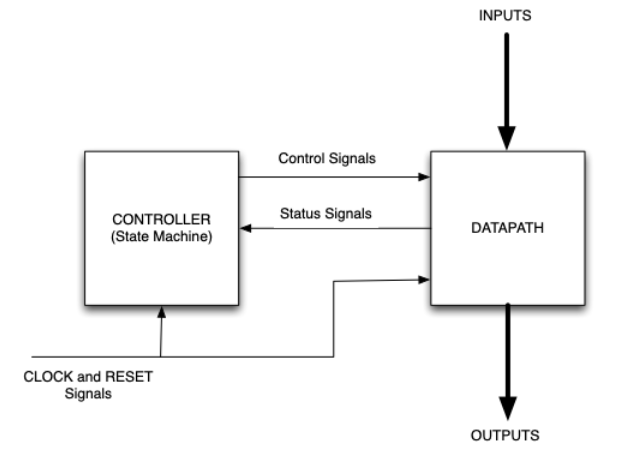
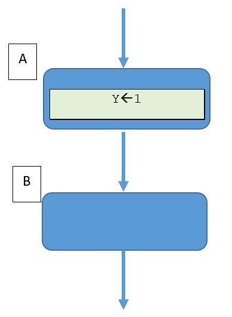
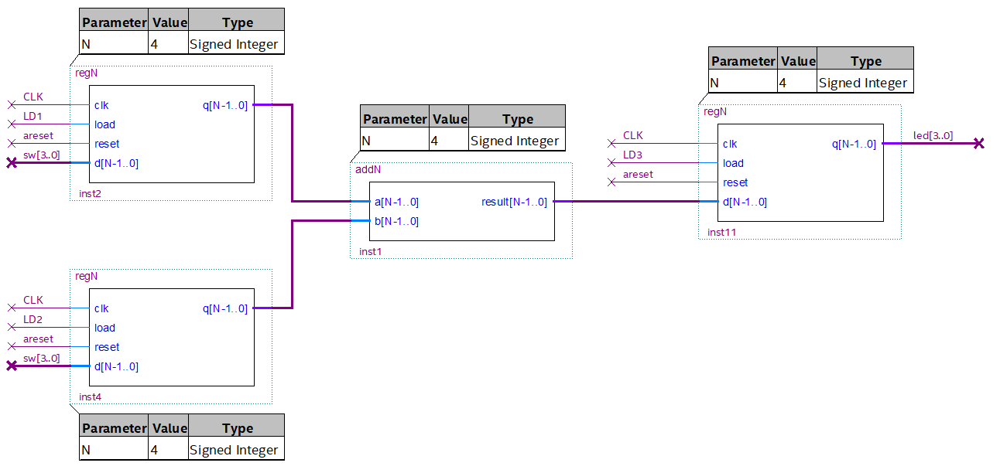
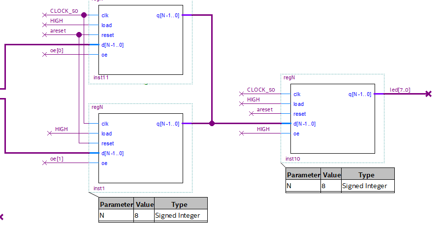
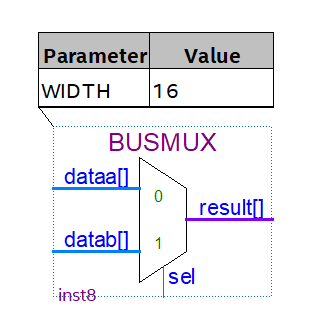
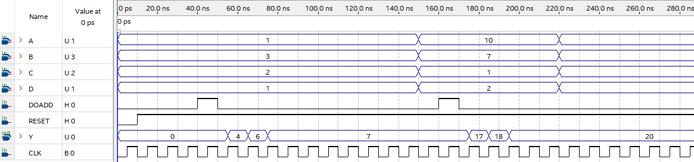
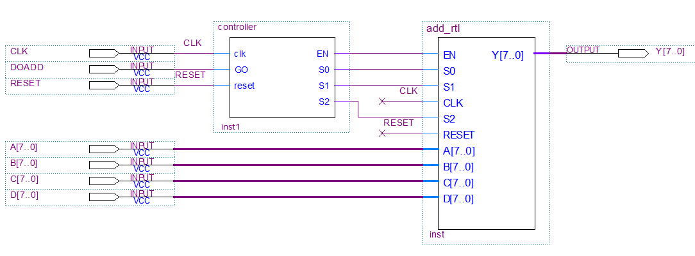
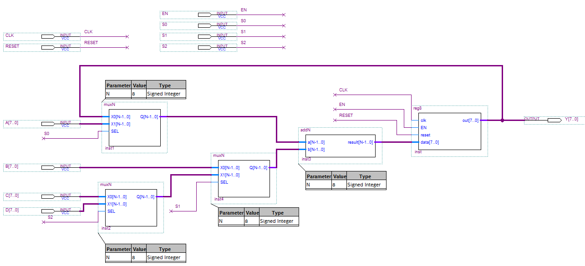

[Back](../README.md)

---

<figure>

</figure>


# Complex Systems
A pre-requisite of this practical is that you have watched and understood the lecture on controller-datapath, and have a basic grasp of the concepts contained within.

Below is a figure summarising the partitioning of a *controller* and a *dataflow* block. 

<figure>

<figcaption>Controller-Dataflow architecture. A controller is typically a finite state machine controlling components in the data-path, and observing returned status signals.</figcaption>
</figure>

* Controllers are typically finite state machines, issuing control signals and responding to status signals coming back
* Data-path components are usually arrangements of standard components, such as registers, multiplexers, arithmetic, coding etc..

We can draw a finite state diagram or an Arithmetic State Machine (ASM) diagram to describe the controller. ASM diagrams also have an extension to support registers, which often play a particularly important role in this scheme. Much like a CPU, registers are a device where you can store values for later use.

Referring back to the lectures, you may recall special symbol for a **register assignment**, as depicted in the figure below:

<figure>

<figcaption>ASM chart showing the register Y being assigned the value 1. For a register assignment, Y will update in state B</figcaption>
</figure>

Note the arrow ← that is used to indicate a **register assignment**.
`Y` is NOT a Moore output. In state `A`, the control signals will be set up so that on the **next** clock edge (state `B`), the register `Y` will hold the value 1 on its output.

## Task-260 Generic Registers
In this task you are going to build, modify and test a register that can be used in a controller-datapath architecture. 

A register is similar to a variable in a C or C++ program, in that you can set it to a value (on one clock edge) and it will remember (latch) that value. We sometimes say you can “set and forget”. One written, we do not need to hold the inputs constant.

We have met a basic parallel in parallel out registers before. There are many variants on the specifics of registers. Let's look at one here that is more complex.

Our aim to design a synchronous N-bit storage device that meets the following requirements:

It shall be possible to..

1. Write `N`-bit data to be stored without interfering with the current output
1. Read `N`-bit stored data when required
1. Control when the device ignores any input data
1. Reset the device asynchronously, with the output being set to `N'd0`

The requirements 1 and 2 demand that we have separate input and output ports as opposed to a single bi-directional port. This uses more signal connections, but also keeps the device simpler.

Requirement 3 suggests a control line used to determine when input data is read and when it is ignored.

Requirement 4 indicates we need an additional input for power-on reset.

One such register is shown below:

```verilog
module regN #(parameter N=8) (
   output logic [N-1:0] q,
   input logic clk,
   input logic load,
   input logic reset,
   input logic [N-1:0] d);
   
   // Internal storage
   logic [N-1:0] latched;
   
   // Delay only used for simulation
   assign #(5ps) q = latched;
   
   always_ff @(posedge clk, negedge reset) begin
   
      if (reset == 1'b0) begin
         latched <= 'd0;
		end
      else if (clk == '1) begin
         if (load == '1) begin
            latched <= d;
         end
      end     
   end 
endmodule
```

This register is now a reusable component that could form part of the data-flow. Note especially how the `load` input must be high for the value to be read. This control signal is critical if we want to select which register to store a value in. 

To really stress this point, let's look at an example where **you** take the role of the controller.

| Task-260 | Generic Registers |
| - | - |
| 1 | Open the Quartus Project in Task260. Build and deploy to your FPGA |
| 2 | Look at the top level schematic. You will see three registers and one (combinational logic) adder |
| - | You should see the purposely slowed clock flashing on `LED[7]` |
| - | `LED[2..0]` connect to the output of the *accumulator* register (furthest right) |
| - | The DIL switches `sw[2..0]` are connected to both input registers |
| - | `key[0]` and `key[1]` control the `load` inputs for each input register |
| - | `LED[4]` is connected to the DIL switch `sw[0]`. This is intended to help you work out which switch is `sw[0]` :) |
| 3 | Toggle `sw[0]` and observe `LED[4]` turning off and on. If it does not, try the other end of the switch block. |
| 4 | Having identified the least significant bit `sw[0]` (and which side is LOW/HIGH), use the DIP switches, set the binary value `001` as the input data |
| 5 | When the clock is LOW (`LED[7]` is off), press and hold `key[0]` until `LED[7]` switches back on. This will store this value in the uppermost register. |
| 6 | Using the DIP switches, set the binary value `010`. |
| 7 | This time, when the clock is LOW (`LED[7]` is off), press and hold `key[1]` until `LED[7]` switches back on. This will store this value in the lower register |
| - | Both register outputs are now set and connect into the adder circuit. The sum of the two values is now presented to the input of the accumulator register |
| 8 | Now to load the summed values into the accumulator register (furthest right), when the clock is LOW (`LED[7]` is off), press and hold **BOTH** `key[0]` and `key[1]` until `LED[7]` switches back on. You should see the summed value `011` displayed on LED[2..0] |

<figure>

<figcaption>Two input data registers and an accumulator register</figcaption>
</figure>

You played the role of the controller in this experiment. Note that you had to follow a sequence so that each register was loaded at the correct time, and in the correct sequence. This is an idea task for a state machine.

Note again that the data and `load` signal is presented **in advance** of the clock edge.

Let's now extend this idea with a text book classic example: the pipelined adder.

## Task-262 Tri-State Outputs
As a general rule, we avoid the use of tr-state logic with FPGAs. Most devices cannot directly connect the outputs of internal logic together.There are two things you can do however:

* Output pins utilise tri-state buffers. Multiple outputs can drive common pins
* Bus networks can be substituted with multiplexers

Let's look at the single case where tri-state outputs can be used.

| Task 262 | BusOutputs |
| - | - |
| 1 | Open the Quartus project in Task 262. Build and deploy |
| - | Note the two devices driving `led[7..0]`. These devices have tri-state outputs |
| 2 | Press key0 to switch the device driving the output pins |
| 3 | Simulate `oe_enable` in ModelSim - Examine how the outputs (`oe[1:0]`) change when the `sel` input is changed |
|- | <p title="A state machine is used so that each OE is pulled low before the other is pulled high, with one clock cycle margin. This avoids the risk of short-circuiting the power rails">What is the function of this block? Hover the mouse to see the answer</p>
| 4 | In Quartus, click Tools->Netlist Viewers->RTL Viewer. Expand one of the `regN` component to reveal the tri-state buffers |

Care is needed when switching devices. Some extra logic (`oe_selector`) is included to ensure the output enables cannot be high at the same time. Bus systems not only need careful timing, but can also be slow.

| Task 262 | Continued |
| - | - |
| 5 | Modify the design and add some logic between the tri-state registers and the output pins, such as in the figure below. |
| - |  In Quartus, build, then once again click Tools->Netlist Viewers->RTL Viewer. |

<figure>

<figcaption>Internal Tri-State Bus will be converted to multiplexers</figcaption>
</figure>

You should find that Quartus has replaced tri-state outputs with a tri-state bus component, which is effectively a multiplexer.

| Task 262 | Continued |
| - | - |
| 6 | Modify the registers so that no tri-state logic is used (permanently enable the devices). Do NOT connect the outputs, and instead route the connected outputs through multiplexer. You can use the `BUSMUX` mega-function component |
| - | A solution is provided |

<figure>

<figcaption>BUSMUX megafunction used to implement internal bus structures</figcaption>
</figure>

Unless absolutely required, for FPGAs you would avoid bus structures, and favour multiplexer trees instead. It is both faster and safer. No special output enable timing logic is needed either. 

## Task-266 Pipelined adder
The pipelined adder is a device which allows multiple values to be added in sequence. In this example, we are to add four separate 8-bit values. We could do this directly, but it would cost us three adder circuits:

| Equation | Circuit |
| - | - |
| `(A + B + C + D)` | Four-port adder, or three parallel 2-port adders `(A+B) + (C+D)` calculated simultaneously. This is fast but consumed 3x adder circuits |
|  `R1 🡐 (A+B)`, `R1 🡐 (R1+C)`, `R1 🡐 (R1+D)` | Use a single adder circuit over 3 consecutive clock cycles. This is slower, but potentially uses less space |  

| Task-266 | Pipelined adder |
| - | - |
| 1 | Open the Quartus project and build. Do not program the board |
| 2 | Double click the vector waveform file `Waveform.wvf` |
| 3 | Click `Simulation->Run Functional Simulation`|
| - | The output shows all outputs of the adder as the sum is built up |

The timing output should resemble the following:

<figure>

<figcaption>Timing Diagram for the Pipelined Add</figcaption>
</figure>

The top level controller-dataflow design is shown below:

<figure>

<figcaption>Top Level Design of the Pipelined Adder</figcaption>
</figure>

Drilling down into the dataflow component, we see a combination of multiplexers, and adder and a register.

<figure>

<figcaption>Dataflow components for the Pipelined Adder</figcaption>
</figure>

The controller is routing data by setting the multiplexer select and register load load lines.

| Task-266 | Continued |
| - | - |
| 4 | Inspect the controller component. It is a Moore machine |
| - | Can you reverse engineer this back to an ASM chart? |
| - | Check the lecture slides to see if you're answer is correct |

A problem with this design is that intermediate outputs are presented. To solve this, do the following:

| Task-266 | Continued |
| - | - |
| 5 | Add another register to the dataflow. We shall call this the output register. The input should be `Y[7..0]` and it should have it's own `load` signal. |
| 6 | Update the controller to load the correct and final sum into the output register. This will need at least one extra state. |
| - | Modify the vector waveform file to test |

## Challenge
As a general rule, I try to avoid vector waveform files as they are specific to Quartus and not something used widely outside of education.

* Replace all the schematics with SystemVerilog components.
* Build a testbench to replicate the results of the vector waveform file

You will probably notice this is quite a lot of work!

---

[Back to TOC](../README.md)


