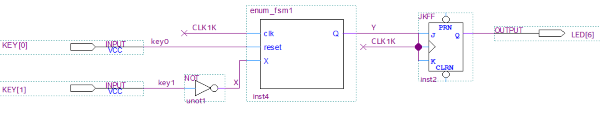

[Back](../README.md)

---

<figure>

</figure>

# Finite State Machines
One of the most important design patterns in digital electronics is the Finite State Machine (FSM). The ability to follow a sequence of steps, often in response to input stimulus, is somewhat similar to execution of an instruction in a microprocessor. The similarity is not accidental either.

There are generally speaking two types of FSM:

* Moore Machine
* Mealy Machine

Both can be made to perform the same task, and both will be studied.

## Moore Machines
The outline design of a Moore machine is shown the figure below:

<figure>

<figcaption>Architecture of a Moore Machine</figcaption>
</figure>

The **STATE** is simply a number which keeps track of where we are in a sequence. It is typically stored in the output of a N-bit register (made from DFFs).

* The state can only update on the clock edge
* The output is a function of the state
* The **next state** is a function of both state and inputs

To give this some concrete meaning, let's look at an simple example. Consider the schematic below:

<figure>

<figcaption>Circuit Diagram for a PUSH-RELEASE controlled switch</figcaption>
</figure>

This is a light control circuit to be used in a conference room. When the user presses and releases the button (`KEY[1]`), the light toggles (either OFF->ON or ON->OFF). The light is attached to the output of a JK FlipFlop, with both J and K connected. This way, when the signal Y is HIGH, the output toggles on the next clock edge.

> So we want Y to pulse HIGH for one-clock cycle every time a switch is pressed and released. 

The timing for this is shown below:

<figure>

<figcaption>Timing Diagram for a PUSH-RELEASE controlled switch</figcaption>
</figure>

The FSM therefore has the following brief:

1. At start-up, the LED is OFF
1. When the switch is pressed, the light comes ON
1. When the switch is released, the light stays ON
1. When the switch is pressed, the light goes OFF
1. When the switch is released, the light stays OFF
1. Goto 2

This can be modelled using a finite state diagram.

<figure>

<figcaption>Finite State Diagram for a PUSH-RELEASE controlled switch</figcaption>
</figure>

Note that outputs are only written on the diagram if they are asserted HIGH. Therefore, in the figure above, we can assume that `Y` is LOW in states `S0` and `S2`.

Any state diagram can be simulated and synthesised using SystemVerilog. The good news is that the HDL always follows a similar pattern. The HDL for this application is shown below:

```verilog
module enum_fsm1 (input logic clk, reset, X, output logic Q);

enum int unsigned { S0 = 1, S1 = 2, S2 = 4 } state, next_state;

always_comb begin : next_state_logic
	
	//Default is to stay in the current state
	next_state = state;
	
	//Conditionally update state
	case(state)
		
	S0:	if (X == '1) 
				next_state = S1;
	
	S1: 	next_state = S2;
	
	S2: 	if (X == '0) 
				next_state = S0; 
		
	endcase
end
	
always_ff @(posedge clk or negedge reset) begin

	if (reset == '0)
		state <= S0;
	else
		state <= next_state;
end
	
always_comb begin : output_logic
	case(state)
	S0:	Q = 0;
	S1:	Q = 1;
	S2:	Q = 0;
	endcase
end

	
endmodule
```

### Enumerated Types
First of all, we always encode the state (and next state) as an unsigned integer. Even better, we use an enumerated type (very similar to C and C++)

```verilog
enum int unsigned { S0 = 1, S1 = 2, S2 = 4 } state, next_state;
```

This means `state` can take on the valid values of `S0`, `S1` and `S2`. Apart from this making code easier to read, it also allows the compiler to perform additional checks and issues warnings in case we forget one of the states (see below).

### Next State Logic
On each clock cycle, the state may be updated. In a state diagram, an update is known as a state transition, as depicted by an arrow exiting the current state. The next state is dictated by two things:

* Current State
* Inputs

In the code extract below, we see this. 

```verilog
always_comb begin : next_state_logic
	
	//Default is to stay in the current state
	next_state = state;
	
	//Conditionally update state
	case(state)
		
	S0:	if (X == '1) 
				next_state = S1;
	
	S1: 	next_state = S2;
	
	S2: 	if (X == '0) 
				next_state = S0; 
		
	endcase
end
```

It is very important to recognise that this is (and MUST be) combinational logic. *There must therefore be no latching behaviour*. This is why we use `always_comb` so that the compiler can check this is the case. It is very easy to accidentally introduce latching behaviour (one of the criticisms of the Verilog language).

The `if` statements look like they are latching (as they don't have an `else`), but  they are not due to the line `next_state = state;`. This means the default is to stay in the current state (think of it as a catch-all `else`) unless one of the following statements overrides it. 

> Setting a default level in this way is a useful technique for ensuring no latching can ever occur.

We could equally have written:

```verilog
always_comb begin : next_state_logic
	
	//Conditionally update state
	case(state)
		
	S0:	if (X == '1) 
				next_state = S1;
        else
                next_state = S0;
	
	S1: 	next_state = S2;
	
	S2: 	if (X == '0) 
				next_state = S0; 
            else
                next_state = S2;
	endcase
end
```

The downside of this approach is that if you forget one of the `else` conditions. Keeping logic concise is also easier to debug.

Which style you choose is up to you.

### Updating the State

Whereas the next-state logic is purely combinational (and potentially asynchronous), the state is synchronous updated on the clock edge. 

```verilog
always_ff @(posedge clk or negedge reset) begin

	if (reset == '0)
		state <= S0;
	else
		state <= next_state;
end
```

Note that `always_ff` is used so the compiler can check that flip-flop behaviour is used. 

### Output Logic
The output of a Moore Machine is simply a function of the current state. Each circle in the state diagram can specify a number of outputs.

Again this is purely combinational logic:

```verilog
always_comb begin : output_logic
	case(state)
	S0:	Q = 0;
	S1:	Q = 1;
	S2:	Q = 0;
	endcase
end
```

### Separation of Concerns
What is appealing about the HDL above is the way each role is performed by a separate `always` block.

* Next state logic
* Output logic
* Update of state (synchronous)

If we wish to modify the state machine, we can focus on each block in turn. The overall structure should never change.

Separating role in this way is sometimes known as *separation of concerns*. Such an approach helps to maintain a scalable solution.

## Task-252 MooreMachine
This task is based on the design discussed above.

| Task252 | Moore Machine |
| - | - |
| 1 | Open the Quartus project in Task252 |
| 2 | Build and deploy the project to your FPGA board |
| 3 | Press and release SW[1] to toggle the LED |
| 4 | Open the HDL for the finite state machine |
| - | Comment out the line that reads `next_state = state;` |
| 5 | Try to rebuild the code - what error does Quartus display? |
| 6 | Remove the comment so the code is unchanged |
| 7 | Now comment out the following two lines |

```verilog
	S2: 	if (X == '0) 
				next_state = S0; 
```

| Task252 | Continued |
| - | - |
| 8 | Build the code. Now look at the warnings (scroll to the top). Can you find an error that reads something like: |
| - | Warning (10270): Verilog HDL Case Statement warning at fsm-moore.sv(21): incomplete case statement has no default case item |
| - | Why is this warning being raised? |
| 9 | Once more, restore the code back to it's original state |
| 10 | Open the Quartus project "Challenge" |

TO BE DONE


Note the use of the non-blocking assignment operator `<=`.


COMING SOON