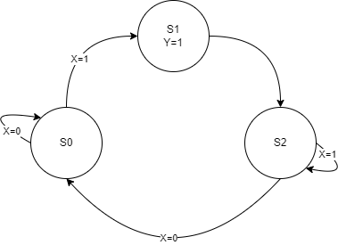
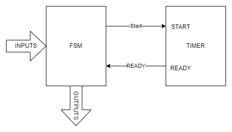
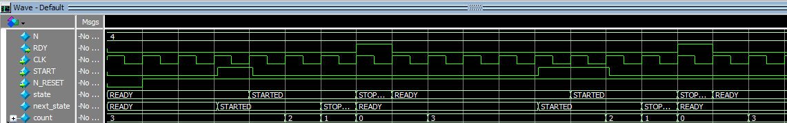
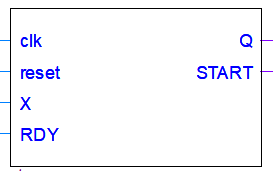
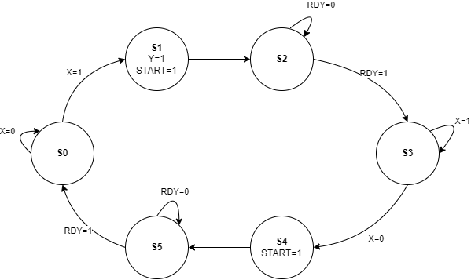
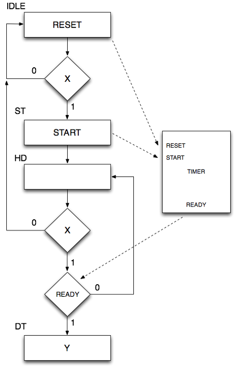
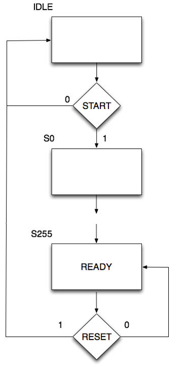

[Back](../README.md)

---

<figure>

</figure>

# Finite State Machines
One of the most important design patterns in digital electronics is the Finite State Machine (FSM). The ability to follow a sequence of steps, often in response to input stimulus, is somewhat similar to execution of an instruction in a microprocessor. The similarity is not accidental either.

There are generally speaking two types of FSM:

* Moore Machine
* Mealy Machine

Both can be made to perform the same task, and both will be studied.

## Moore Machines
The outline design of a Moore machine is shown the figure below:

<figure>

<figcaption>Architecture of a Moore Machine</figcaption>
</figure>

The **STATE** is simply a number which keeps track of where we are in a sequence. It is typically stored in the output of a N-bit register (made from DFFs).

* The state can only update on the clock edge
* The output is a function of the state
* The **next state** is a function of both state and inputs

To give this some concrete meaning, let's look at an simple example. Consider the schematic below:

<figure>

<figcaption>Circuit Diagram for a PUSH-RELEASE controlled switch</figcaption>
</figure>

This is a light control circuit to be used in a conference room. When the user presses and releases the button (`KEY[1]`), the light toggles (either OFF->ON or ON->OFF). The light is attached to the output of a JK FlipFlop, with both J and K connected. This way, when the signal Y is HIGH, the output toggles on the next clock edge.

> So we want Y to pulse HIGH for one-clock cycle every time a switch is pressed and released. 

The timing for this is shown below:

<figure>

<figcaption>Timing Diagram for a PUSH-RELEASE controlled switch</figcaption>
</figure>

The FSM therefore has the following brief:

1. At start-up, the LED is OFF
1. When the switch is pressed, the light comes ON
1. When the switch is released, the light stays ON
1. When the switch is pressed, the light goes OFF
1. When the switch is released, the light stays OFF
1. Goto 2

This can be modelled using a finite state diagram.

<figure>

<figcaption>Finite State Diagram for a PUSH-RELEASE controlled switch</figcaption>
</figure>

Note that outputs are only written on the diagram if they are asserted HIGH. Therefore, in the figure above, we can assume that `Y` is LOW in states `S0` and `S2`.

Any state diagram can be simulated and synthesised using SystemVerilog. The good news is that the HDL always follows a similar pattern. The HDL for this application is shown below:

```verilog
module enum_fsm1 (input logic clk, reset, X, output logic Q);

enum int unsigned { S0 = 1, S1 = 2, S2 = 4 } state, next_state;

always_comb begin : next_state_logic
	
	//Default is to stay in the current state
	next_state = state;
	
	//Conditionally update state
	case(state)
		
	S0:	if (X == '1) 
				next_state = S1;
	
	S1: 	next_state = S2;
	
	S2: 	if (X == '0) 
				next_state = S0; 
		
	endcase
end
	
always_ff @(posedge clk or negedge reset) begin

	if (reset == '0)
		state <= S0;
	else
		state <= next_state;
end
	
always_comb begin : output_logic
	case(state)
	S0:	Q = 0;
	S1:	Q = 1;
	S2:	Q = 0;
	endcase
end

	
endmodule
```

### Enumerated Types
First of all, we always encode the state (and next state) as an unsigned integer. Even better, we can use an enumerated type (very similar to C and C++)

```verilog
enum int unsigned { S0 = 1, S1 = 2, S2 = 4 } state, next_state;
```

This means `state` can take on the valid values of `S0`, `S1` and `S2`. Apart from this making code easier to read, it also allows the compiler to perform additional checks and issues warnings in case we forget one of the states (see below).

There are some useful *methods* (think of these like functions that operate on the values).

```verilog
enum int unsigned { S0 = 1, S1 = 2, S2 = 4 } state, next_state;
state = state.first();	// state is now S0
state = state.last();   // state is now S2
state = S0;
state = state.next();	// state is now S1
state = state.prev();	// state is now S0
state = state.prev();	// state is now S2 (wraps around)
$display(state.name()); // "S2"
$display("%d", state.num()); // Number of elements 3
```

These functions are very useful if you want to iterate over all types.

### typedef
Like C and C++, we can create new types with `typedef`. So if we wish to reuse an enumerated type for example, we could write:

```verilog
typedef enum int unsigned { S0 = 1, S1 = 2, S2 = 4 } STATE_t;
STATE_t state, next_state;
```

The `_t` suffix is often used to denote a type.

### Next State Logic
On each clock cycle, the state may be updated. In a state diagram, an update is known as a state transition, as depicted by an arrow exiting the current state. The next state is dictated by two things:

* Current State
* Inputs

In the code extract below, we see this. 

```verilog
always_comb begin : next_state_logic
	
	//Default is to stay in the current state
	next_state = state;
	
	//Conditionally update state
	case(state)
		
	S0:	if (X == '1) 
				next_state = S1;
	
	S1: 	next_state = S2;
	
	S2: 	if (X == '0) 
				next_state = S0; 
		
	endcase
end
```

It is very important to recognise that this is (and MUST be) combinational logic. *There must therefore be no latching behaviour*. This is why we use `always_comb` so that the compiler can check this is the case. It is very easy to accidentally introduce latching behaviour (one of the criticisms of the Verilog language).

The `if` statements look like they are latching (as they don't have an `else`), but  they are not due to the line `next_state = state;`. This means the default is to stay in the current state (think of it as a catch-all `else`) unless one of the following statements overrides it. 

> Setting a default level in this way is a useful technique for ensuring no latching can ever occur.

We could equally have written:

```verilog
always_comb begin : next_state_logic
	
	//Conditionally update state
	case(state)
		
	S0:	if (X == '1) 
				next_state = S1;
        else
                next_state = S0;
	
	S1: 	next_state = S2;
	
	S2: 	if (X == '0) 
				next_state = S0; 
            else
                next_state = S2;
	endcase
end
```

The downside of this approach is that if you forget one of the `else` conditions. Keeping logic concise is also easier to debug.

Which style you choose is up to you.

### Updating the State

Whereas the next-state logic is purely combinational (and potentially asynchronous), the state is synchronous updated on the clock edge. 

```verilog
always_ff @(posedge clk or negedge reset) begin

	if (reset == '0)
		state <= S0;
	else
		state <= next_state;
end
```

Note that `always_ff` is used so the compiler can check that flip-flop behaviour is used. 

### Output Logic
The output of a Moore Machine is simply a function of the current state. Each circle in the state diagram can specify a number of outputs.

Again this is purely combinational logic:

```verilog
always_comb begin : output_logic
	case(state)
	S0:	Q = 0;
	S1:	Q = 1;
	S2:	Q = 0;
	endcase
end
```

### Separation of Concerns
What is appealing about the HDL above is the way each role is performed by a separate `always` block.

* Next state logic
* Output logic
* Update of state (synchronous)

If we wish to modify the state machine, we can focus on each block in turn. The overall structure should never change.

Separating role in this way is sometimes known as *separation of concerns*. Such an approach helps to maintain a scalable solution.

## Task-252 MooreMachine
This task is based on the design discussed above.

| Task252 | Moore Machine |
| - | - |
| 1 | Open the Quartus project in Task252 |
| 2 | Build and deploy the project to your FPGA board |
| 3 | Press and release SW[1] to toggle the LED |
| 4 | Open the HDL for the finite state machine |
| - | Comment out the line that reads `next_state = state;` |
| 5 | Try to rebuild the code - what error does Quartus display? |
| 6 | Remove the comment so the code is unchanged |
| 7 | Now comment out the following two lines |

```verilog
	S2: 	if (X == '0) 
				next_state = S0; 
```

| Task252 | Continued |
| - | - |
| 8 | Build the code. Now look at the warnings (scroll to the top). Can you find an error that reads something like: |
| - | Warning (10270): Verilog HDL Case Statement warning at fsm-moore.sv(21): incomplete case statement has no default case item |
| - | Why is this warning being raised? |
| 9 | Once more, restore the code back to it's original state |
| 10 | Open the Quartus project "Challenge" |

### Challenge
Open the Quartus project in the `Challenge` folder. You will see a top level schematic.  Double click the `led_controller` and complete the next state logic.

The output should be the same as the following video:

https://plymouth.cloud.panopto.eu/Panopto/Pages/Viewer.aspx?id=40a5f82c-65e6-440f-9587-ae4400b2f05a

The state diagram for this controller is shown below:

<figure>

<figcaption>Finite State Diagram for Challenge 252. The inputs UP_PULSE and DOWN_PULSE are shortened for UP and DOWN for clarity</figcaption>
</figure>

Note the following:

* The state encoding is chosen so no output logic is needed. 
* The inputs `UP_PULSE` and `DOWN_PULSE` are generated when a button is pressed and released, and are always one clock cycle in duration 
   * Having already performed this function in another state machine, this helps to make the `led_controller` state machine much simpler.
   * This is another example of *separation of concerns*
* Use the *methods* `next()`, `prev()`, `first()` and `last()` to your advantage ( [see section on enumerated types](#enumerated-types) ).
* A solution is provided in the `Challenge-solution` folder

## Task-254 Mealy Machine
The Mealy machine has a slightly different architecture to the Moore Machine, and is depicted below:

<figure>

<figcaption>Mealy Machine Architecture</figcaption>
</figure>

To contrast this with a Moore Machine:

* The next state is a function of the current state and inputs (same as Moore)
* The outputs are a function of *both* the current state *and inputs* (different to Moore)

We return to the first example in this section, where we designed a Moore Machine to produce a pulse when a switch is pressed and released. This required 3 states. Therefore, 2 flip flops were needed for the state encoding (00, 01, 10). A modified state diagram for this FSM is shown below:

<figure>

<figcaption>Moore Machine Finite State Diagram for a PUSH-RELEASE controlled switch</figcaption>
</figure>

We can convert this to a Mealy Machine. First, we write the state-transition diagram for the Moore Machine as follows:

| STATE | -> |  X=0 | X=1 | Y |
| - | - | - | - | - |
| S0 | | S0(self) | S1 | 0 |
| S1 | | S0 | S2 | 1 |
| S2 | | S0 | S2 (self) | 0 |

As you can see, there is no redundancy and no opportunity for state minimisation in Moore Machine format.

We next make a note of the output `Y` for a given state as follows:

| STATE | Y |
| - | - |
| S0 | 0 |
| S1 | 1 |
| S2 | 0 |

Substituting `S0` for `S0/0`, `S1` for `S1/1` and `S2` for `S2/0`,
we write the Mealy Machine state transition table as follows:

| STATE | -> |  X=0 | X=1 |
| - | - | - | - | 
| S0 | | S0(self)/0 | S1/1 |
| S1 | | S0/0 | S2/0 |
| S2 | | S0/0 | S2 (self)/0 |

We see rows for `S1` and `S2` are equivalent. Therefore, we write a new Mealy State Diagram:

<figure>

<figcaption>Mealy Machine Finite State Diagram for a PUSH-RELEASE controlled switch</figcaption>
</figure>

Now we are down to 2 states, which requires only ONE d-type flip flop.
The implementation of the Mealy machine is shown in the file `fsm_mealy.sv` and is copied below.

```verilog
module fsm_mealy (input logic clk, reset, X, output logic Q);

typedef enum int unsigned { S0 = 1, S1 = 2} state_t;
state_t state, next_state;

always_comb begin : next_state_logic

   //Default is to stay in the current state
   next_state = state;

   //Conditionally update state
   case(state)

   S0:   if (X == '1)
            next_state = S1;

   S1:   if (X == '0)
            next_state = S0;
   default:
         next_state = S0;

   endcase

end

always_ff @(posedge clk or negedge reset) begin

   if (reset == '0)
      state <= S0;
   else
      state <= next_state;
end

always_comb begin : output_logic
   case(state)
   S0:   Q = (X == 0) ? 0 : 1;
   S1:   Q = 0;
   default: Q = 0;
   endcase
end

endmodule
```

The main differences are there are less states, and the output logic has changed. Looking specifically at the output logic, we can see `Q` is a function of both `state` and `X`.

```verilog
   case(state)
   S0:   Q = (X == 0) ? 0 : 1;
   S1:   Q = 0;
   default: Q = 0;
   endcase
```

It is interesting to compare the Moore machine and Mealy machine outputs for the same inputs. 

| Task254 | Mealy Machine |
| - | - |
| 1 | Open the Quartus project in Task254 |
| 2 | Build and deploy the project to your FPGA board |
| - | Check that it works as before |
| - | Review `fsm_mealy.sv` |
| 3 | Complete the test bench `fsm_mealy_tb.sv` and show the two state machines perform a similar function |
| - | See `fsm_mealy_tb-solution.sv` if you are stuck |

Do you get equivalent outputs? It should be noted that the precise timing of the Mealy output will depend on the input `X`. We would normally assume `X` is a synchronous signal.

## Task-256 Timers
The examples so far have assumed the switches to be ideal. Real world switch inputs will have contact noise. Let us assume we were to use some cheaper push switches with no debounce circuitry. Debounce would work as follows:

1. Wait for switch to be pressed
1. Wait for Tms (and ignore the switch)
1. Wait for switch to be released
1. Wait for Tms (and ignore the switch)
1. Repeat

How do you wait for Tms? Remember, we are writing components that are synthesised in hardware, and there is NO CPU. Delay instructions in SystemVerilog only have meaning in simulation. The answer is usually to use a timer.

The figure below depicts the idea of using a timer. The timer will start counting once the `START` signal is asserted HIGH. After the required number of clock cycles, the timer will reset and set the `READY` signal HIGH. When the FSM needs to wait for a period of time, in a given state it can start the timer and not advance to the next until the `READY` signal flags that time has past. In essence, these are two synchronised state machines. 

<figure>

<figcaption>Two coupled state machines: a controller and a timer</figcaption>
</figure>

Timers can be quite elaborate, but we are going to start with a simple example. You can always design your own and customise it as much as you like!

| Task256 | Timers |
| - | - |
| 1 | Open the Quartus project in Task256 |
| - | Build and deploy. It is based on the example in the previous task. Test to see it working. |
| 2 | Read the source and comments in `fsm_timer.sv` |
| - | A timing diagram from a simulation of this component is shown below |

<figure>

<figcaption>Timing diagram for the timer</figcaption>
</figure>

The key behaviours are as follows:

* When the `START` input is HIGH, the timer starts to count from N-1 down to 0 (where N is a parameter)
* When the count reaches zero, the `RDY` output goes HIGH for one clock cycle
* The timer then waits for `START` again

To add compensation for switch bounce, the component `fsm_moore` has been modified such that is has a new input and output:

<figure>

<figcaption>Modified FSM to include control and feedback signal</figcaption>
</figure>


* `START` (output) which is connected to the `START` input port of the timer. This is used to start the timer counting.
* `RDY` which is connected to the `RDY` output port of the timer. This input is used to check when the timer is finished.

However, the code has not been changed to use the new input and output. Your task is to now modify the state machine in `fsm_moore` to make use of this timer.

| Task256 | continued |
| - | - |
| 3 | Modify `fsm_moore.sv` to include switch-bounce compensation. |
| - | Add additional states to control and monitor the timer (as per the figure below) |
| - | Make the delay large to begin with so it is apparent when it is working |

<figure>

<figcaption>Modified State Diagram to include switch bounce compensation</figcaption>
</figure>

Remember that no all outgoing arrows are shown. For example, in `S0` we do not care about the input `RDY`. So the outgoing arrow apples for `{X,RDY}={1,0}` or `{1,1}`.

| Task258 | Linked State Machines |
| - | - |
| 1 | Open the Quartus project in Task258 |
| - | Examine the top level schematic |
| 2 | Your task is to complete the modules `fsm_moore` and `fsm_timer` to implement the ASM diagrams below. Currently they are incomplete an do not compile. |
| - | The intention is that to turn on the LED, the push button has to be pressed for 0.5s |
| - | A solution is provided |
| - | Consult the lectures on ASM charts |

<figure>

<figcaption>ASM chart for the fsm_moore component </figcaption>
</figure>

<figure>

<figcaption>ASM chart for the fsm_timer component </figcaption>
</figure>


## Reflection

This section has introduced the simulation and synthesis of Moore and Mealy machines in SystemVerilog.

Finite State Machines are a key component in any complex system. They frequently play the role of a *controller* , asserting control signals and monitoring status signals.

We used a finite state machine template provided with the Quartus software. This separates next state logic, output logic and the update of the state itself into distinct always blocks. As states are added, or new problems are presented, the same template can be reused.

We need to be careful not to let our state machines become unwieldy. In this section we create separate state machines, and coupled them together. A good example of this is a timer. If we were to integrate a timer into another state machine, no only would be generate a lot of additional states and complexity, we would be writing HDL that cannot easily be repurposed.

As we will see in the next section, state machine based designs can be used to trade gate count for speed.

## References

See [References](references.md) for a list of numbered references in this course.


---

[NEXT - Complex Systems](./complex_sys.md)