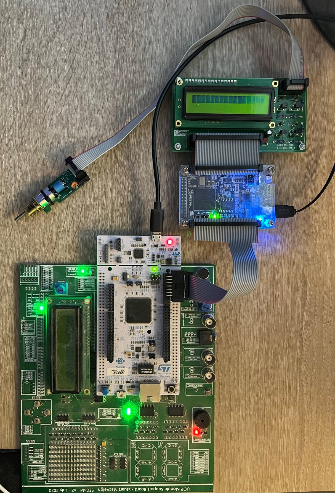

[Back](../README.md)

---

<figure>

</figure>


# Hardware Debugging
Up until now, we have focused very much on simulation. There are times when it is necessary to debug using real hardware. This might be for a number of reasons, including:

* Signals are very fast and simulation takes too long
* You might want to perform live interactive tests

In this short lab, we will monitor a system where a Microcontroller communicates with a FPGA using the Serial Peripheral Interface (SPI).

## Task 270-SPI

In this task, explore using SPI to allow a Microcontroller and a FPGA to communicate. In the example, the Microcontroller is known as the master device, and generates the serial clock, MOSI and Chip Select (CS) signals. The FPGA responds with serial data on the MISO signal.

Follow the step below, **in the order that they are written**.

| Task-270 | SPI |
| - | - |
| 1. | Start Mbed Studio. Within the Task-270 folder, there is a sub-folder MCU. Set the Workspace folder to the MCU folder |
| 2. | Build and run the code |
| 3. | Disconnect the MCU and FPGA USB cables no neither are powered on. |
| 4. | Now connect the ribbon cable to the FPGA connector as shown in the figure below |
| 5. | Reconnect the USB cables so both devices are powered on. |
| 6. | Open the Quartus Project in FPGA folder. Build and deploy to your FPGA |
| 7. | Read through the MCU code in main.cpp |


<figure>

<figcaption>Figure 1. Connect the FPGA to the MCU using the ribbon cable provided. Always program the MCU with the provided code before doing this.</figcaption>
</figure>


You should now see the following:

* An alternating LED pattern on the FPGA board
* Text being printed out in the serial terminal

Carefully change the DIP switch settings using a pointed tool. Note the changes in the serial output.

| |  |
| - | - |
| 8. | Where and how in the MCU software do we read the switch positions? |
| 9. | How is it possible we can read and write a value to a device at the same time? |

**Key Points:**

Mbed has special types to hide some of the complexity. You have met some of these already, such as `DigitalOut`, `DigitalIn` etc. We also have a similar type known as `SPI`. The following code shows you how to connect one of the internal SPI controllers to specific pins: 

```C++
// MOSI - PA_7
// MISO - PA_6
// SCLK - PA_5
SPI spi(PA_7, PA_6, PA_5);      
```

We also need a chip select. In this example, it was decided to do control chip select manually using a `DigitalOut` type:

```C++
DigitalOut cs(PC_6);  
```

When we initialise our system, we need to set the mode and speed:

```C++
// Chip must be deselected, Chip Select is active LOW
cs = 1;                     
// Setup the DATA frame SPI for 16 bit wide word, Clock Polarity 0 and Clock Phase 0 (0)
spi.format(16,0);
// 1MHz serial clock rate
spi.frequency(1000000);    
```

To send and receive data to / from the FPGA, you have been provided with the following function:

```C++
uint16_t spi_readwrite(uint16_t data) {
    //Select the device by seting chip select LOW	
    cs = 0; 

    //Send the data - store the return data
    uint16_t rx = (uint16_t)spi.write(data);

    //Wait for last clock cycle to clear
    wait_us(1);

    //De-Select the device by seting chip select HIGH
    cs = 1;             									
    wait_us(1);

    //Return the data recieved via MISO (from the FPGA)
    return rx;
}
```

Note the basic sequence:

* Pull Chip Select LOW
* Write the data
* Pull Chip Select HIGH

In the main loop, we see the following:

```C++
        rx = spi_readwrite(0x00AA);     // Send binary 0000 0000 1010 1010
        printf("Recieved: %u\n",rx);    // Display the value returned by the FPGA
        wait_us(1000000);               // 
        rx = spi_readwrite(0x0055);     // Send binary 0000 0000 0101 0101
        printf("Recieved: %u\n",rx);    // Display the value returned by the FPGA
        wait_us(1000000);               //
```

A key point to note about SPI is this: when you write to SPI, you send data out on the MOSI line. At the same time, you read data in via the MISO line.

> It is often the case that we write a command to a device. It is only on the subsequent write that we get the opportunity to read back the response.

### Challenge-1

This is a programming task to familiarize you with interfacing over SPI. 

Modify the code in Task-270 to produce the following LED pattern:

    1. All LEDs on
    2. Wait for 1s
    3. All LEDs off
    4. Wait for 1s
    5. All the even LEDs on
    6. Wait for 1s
    7. All the odd LEDs on
    8. Wait for 1s
    9. Go to 1

### Challenge-2

In this task, you will use the position of the three DIP switches to select which LED is on.

Your main loop should read back the DIP switch settings from the FPGA (unsigned integer), and send a command to light the corresponding LED.

 Note that SPI reads and writes a word at the same time, but the value you read is the response to the previous write (they are skewed).

For example:
* SW3, SW2 and SW1 set to 111 all on would result in LED7 being illuminated (sends binary 10000000)
* SW3, SW2 and SW1 set to 000 all on would result in LED0 being illuminated (sends binary 00000001)
* SW3, SW2 and SW1 set to 010 all on would result in LED2 being illuminated (sends binary 00000100)


In effect, you are building a software decoder.

## Task - Debugging Hardware with Signal Tap

In this task we are going to perform some on-chip FPGA hardware debugging. Quartus has a facility to add some additional logic to your design. This logic acts as a **logic analyser**. 

> It samples internal signals, and uses on-chip RAM to store them until the RAM is full. It then sends them back to Quartus (over USB) for display in a timing diagram.

**Observing the SPI Data Using Signal Tap**

1. Watch this video - https://plymouth.cloud.panopto.eu/Panopto/Pages/Viewer.aspx?id=5a4e548d-207f-4509-a4d4-b0fc010c86cc
1. Now repeat this on your own computer.
1. Modify the source code to use a 500KHz SCLK and capture again.

Hopefully, this will help you with debugging on your group project.

---

[Back](../README.md)