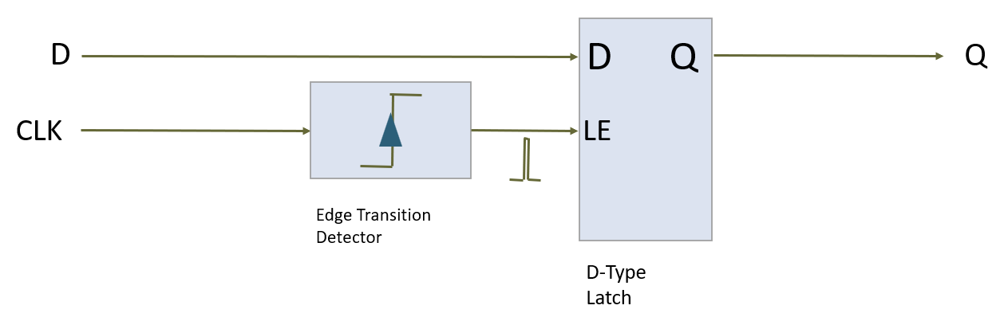

[Back](../README.md)

---

<figure>

</figure>

# Sequential Logic

In this section, we will begin to look at sequential logic circuits.

This practical session is designed to be standalone. However, chapter 5 in [1] will compliment it as supplementary reading.

| TABLE OF CONTENTS |
| - |
[Intended Leaning Outcomes](#Intended-Learning-Outcomes)
[Sequential Logic](#Sequential-Logic)
[Task-230 Latching Outputs](#Task-230-Latching-Outputs)
[Excitation Lists](#excitation-lists)
[Assignment Operators](#assignment-operators)
[`always` blocks](#always-blocks)
[Task-232 Asynchronous Inputs](#task-232-asynchronous-inputs)
[Task-234 D-Latch](#task-234-d-latch)
[Task-236 D-Type flip-flop (DFF)](#task-236-d-type-flip-flop-dff)
[Task-238 J-K Flip-Flop](#task-238-j-k-flip-flop)
[Task 240 Modelling Delays](#task-240-modelling-delays)
[Testing](#testing)
[`initial` blocks](#initial-blocks)
[Clocks](#clocks)
[Reset Signals](#reset-signals)
[Waiting for a change](#waiting-for-a-change)
[Understanding `always`](#understanding-always)
[Challenges](#Challenges)
[Reflection](#reflection)
[References](#References)

## Intended Learning Outcomes

By the end of this section, you should be able to:

* Create a component with latched outputs
* Contrast and correctly apply non-blocking and blocking assignments
* Contrast and correctly apply `always`, `always_comb`, `always_latch` and `always_ff` in a behavioural model
* Use an `excitation list` as part of a behavioural model
* Create a component that qualifies as a flip flop
* Simulate a clock signal for the purpose of testing
* Create common sequential building blocks, including a D-Latch, SR-Latch, D-FlipFlop and JK-FlipFlop 
* Use asynchronous inputs to define the startup state of a component
* Explain the role of propagation delay when cascading flip-flop devices

## Sequential Logic
In the previous section, we looked at creating combinational logic component in SystemVerilog. All digital systems contain combinational logic. 

You may recall that when the inputs of combinational logic change, the outputs need time to settle to a steady state. During this short period, outputs can be spurious and in some cases, even dangerous. 

Furthermore, combinational logic has no memory of the past. The output is simply a function of it's current inputs. The internal logic and outputs retain no means to remember previous values.

Sequential logic is so named because it is the sequence of events that are taken into account. Sequential logic outputs are function of the current and past inputs. To achieve this, some form of memory is needed, which is synthesised by way of logic circuits with feedback. This is described in section 5.1 of [1].

## Task-230 Latching Outputs
In this task, we will look closely at a device known as an S-R Latch. 

| Task-230 | Latching Outputs |
| - | - |
| 1 | [watch this video](https://plymouth.cloud.panopto.eu/Panopto/Pages/Viewer.aspx?id=3e2b3c6e-1a58-45d0-b735-ae2f00c85511) and replicate |
| 2 | Write a testbench `srgate_tb.sv` to automate the tests used in this video |
| - | A solution `srgate_tb-solution.sv` is provided | 

Some key points:

* When first used, the output was undefined `x`
* The output `Q` was set HIGH when input `S` was HIGH
* The output `Q` was set LOW when input `S` was LOW
* When `S` and `R` are both LOW, the output **latches** (holds it's value)
* When `S` and `R` are both HIGH, this is considered an illegal condition
* There is more than one type of `always` block. This has an impact on behaviour.

Let's now review the code below:

```verilog
module srgate (output logic Q, Qbar, input logic S, R);
always @(S,R) 
begin
	if ( (S==1) && (R==0) )
		{Q, Qbar} <= 2'b10;
	else if ( (S == 0) && (R == 1) )
		{Q, Qbar} <= 2'b01;
	else if ( (S == 1) && (R == 1) )
		{Q, Qbar} <= 2'bzz;
    // No coverage of the input combination 0,0!!!
end
endmodule
```

A critical point to observe is that the input combination `{S,R} = {0,0}` is not covered by the if-statement. By default, this creates an **implicit latch**. This behaviour was overridden when we changed `always` to `always_comb`, and forced the compiler to only use combinational logic (which cannot latch outputs).

Some other points to note:

* This component used something referred to as a **non-blocking assignment operator** `<=`
* The `always` statement is followed by `@(S,R)`. This is known as an *event list* (also known as an excitation list)

S-R Latches are just one type of latch.

### Excitation Lists
The excitation list (or event list) is a very important concept in both Verilog and SystemVerilog.

| Task-230 | continued |
| - | - |
| 3 | Compile and edit the solution `srgate_tb-solution.sv` | 
| 4 | Run the simulation. Note the output |
| 5 | Now watch [the following video](https://plymouth.cloud.panopto.eu/Panopto/Pages/Viewer.aspx?id=61f7d931-6535-4ec9-a155-ae2f0120e8c9) |
| 6 | Replicate what you saw in the video. Use the debugger in ModelSim to step through to better understand the behaviour being modelled |

An extract from the testbench is shown below. For this block, we can see the excitation list contains both `S` and `R`, so if either changes, so the block is updated and the values of `S` and `R` are written to the console. 

```verilog
//This block only runs when S or R **change**
always @(S,R)
begin
	$display("{S,R}={%b,%b}", S, R);
end
```

If `Q` changes as a result of `S` and `R` changing, then the following block detects this and displays the value of `Q`.

```verilog
//This block only runs when Q changes
always @(Q)
begin
	$display("Q => %b", Q);
end
```

Now we see how the excitation list is used to detect change events, let's return to the S-R Latch and look again at the excitation list:

```verilog
module srgate (output logic Q, Qbar, input logic S, R);
always @(S,R) 
begin
	if ( (S==1) && (R==0) )
		{Q, Qbar} <= 2'b10;
	else if ( (S == 0) && (R == 1) )
		{Q, Qbar} <= 2'b01;
	else if ( (S == 1) && (R == 1) )
		{Q, Qbar} <= 2'bzz;
    // No coverage of the input combination 0,0!!!
end
endmodule
```

The `always` block asserts `Q` and `Bbar`, but only update if `S` or `R` change. Updates to `Q` and `Bbar` are therefore synchronised with changes in either `S` or `R`. It should be stressed that unlike the testbench, this component can be synthesised.

| Task-230 | continued |
| - | - |
| 7 | What happens if you remove `R` from the excitation list? | 
| - | Also look at the wave output. Double click and error message to jump to the position in the wave |
| 8 | Now remove the excitation list entirely. Recompile and start the simulation. Do NOT click the Run -All button. This time step line by line through the simulation. |

Now how `always` without a excitation list performs an infinite loop?

| Task-230 | continued |
| - | - |
| 9 | Change `always` to `always_latch` |
| - | Note this is only supported in SystemVerilog. Excitation lists are not permitted |
| 10 | Simulate - does the component behave correctly and pass all tests? | 

`always_latch` is usually preferred to `always` as it is safer. It will infer the correct excitation list (so you don't forget - an easy mistake to make!). Another way to do this is to use `always @*` (supported in Verilog) although they are not entirely equivalent.

Note that Simulation tools may behave differently.

### Variation
The example so far has used the familiar `if else`. You can also use a `case` statement.

```verilog
module srgate (output logic Q, Qbar, input logic S, R);
always_latch
begin
	case ({S,R})
		2'b10 : {Q, Qbar} <= 2'b10;
		2'b01 : {Q, Qbar} <= 2'b01;
		2'b11 : {Q, Qbar} <= 2'bzz;		
	endcase
	// Again, no coverage of the input combination 0 0
end
endmodule
```

| Task-230 | continued |
| - | - |
| 11 | Change `always` to `always_comb` and re-simulate |
| -  | Does the latching behaviour remain? |
| 12 | Open the Quartus project. Try and build. What happens? |

It is interesting that ModelSim did not issue a warning or error, and the latching behaviour was still modelled. Quartus however considered this an error.

### Assignment Operators
You may have noticed that the so-called *non-blocking* assignment operator `<=` was used instead of the *blocking* operator `=`. More will be said about this later (it needs careful explanation!). For now, note the following guideline: for combinational logic, use `=`. For sequential logic, use `<=`.

### `always` blocks
In verilog, the `@always` block is used for behavioural HDL. The stimulus list and the code within needs to be written carefully to avoid *unintended* (e.g. unintended latching). The compiler does not necessarily warn you either.

To help you be more prescriptive, SystemVerilog introduces three more:

* `always_comb` for combinational logic
* `always_latch` for latching behaviour
* `always_ff` for flip-flop behaviour (see below)

## Task-232 Asynchronous Inputs
In simulation, it is possible to initialise signals at the start of simulation. When you synthesise however, this will have no effect. The initial state of logic gates will be dependant on the hardware, and not on your HDL. Therefore, it is considered good practise to always initialise hardware to a known state when power is first applied. This is typically with a reset signal. 

| Task-232 | Asynchronous Inputs |
| - | - |
| 1 | In the folder Task-232, open the Quartus Project. Build and program. |
| 2 | Press key0 to SET, then press key1 to RESET |
| 3 | Can you explain why no LEDs are on when you first program the FPGA? |

This component now has an **asynchronous reset** added.

```verilog
module srgate (output logic Q, Qbar, input logic S, R, n_reset);

always @(S,R,n_reset)
begin
	if (n_reset == 0) begin
		Q    <= 0;
		Qbar <= 0;
	end
	else if ( (S==1) && (R==0) )
		{Q, Qbar} <= 2'b10;
	else if ( (S == 0) && (R == 1) )
		{Q, Qbar} <= 2'b01;
	else if ( (S == 1'b1) && (R == 1'b1) )
		{Q, Qbar} <= 2'bzz;
	// No coverage of the input combination 0 0 !!!!
end

endmodule
```

Note how the `n_reset` (active low) was added. This input signal takes precedence over the other two, so as long as `n_reset` is held low, `Q` and `Qbar` are both held low.

| Task-232 | continued |
| - | - |
| 4 | Write a testbench for this version of the SR-latch. Include the asynchronous input. Check that `S` and `R` are ignored as long as `n_reset` is low |
| - | A solution `srgate_tb-solution.sv` is provided |

## Task-234 D-Latch
The SR Latch is the most basic sequential building block, but is rarely used. Much more common is the D-Latch (see section 5.1.2 in [1]).

A SystemVerilog model for a D-Latch is shown below:

```verilog
module dlatch (output logic Q, input logic D, EN, n_Reset);

always_latch
	if (n_Reset == 1'b0) 
		Q <= 0;
	else if (EN == 1'b1)
		Q <= D;

endmodule
```

> **Note** that although all states of `n_Reset` are covered, the condition for `EN=0` is not covered. This is the latching condition.

In some ways, this HDL defines a D-Latch clearer than words. First of all, an asynchronous reset has been added. This overrides all other behaviour as before.
What is of most interest is the behaviour when `n_Reset = 1`.

* When the **level** of `EN` is HIGH, then the output `Q` will simply follow the value of input `D`
* When the **level** of `EN` is LOW, the output `Q` will latch it's current value

Note the stress of the word *level*. As long as `EN` is held HIGH, so `Q` will follow `D`. A truth table can be written as follows:

| n_Reset | EN | D | Q |
| - | -  | - | - |
| 0 | x | x | 0 |
| 1 | 0  | x | Q |
| 1 | 1  | 0 | 0 |
| 1 | 1  | 1 | 1 |

where `x` represents a don't care. Another way to look at it is that the device ignores the input `D` when `EN` is LOW.

| Task-234 | D-Latch |
| - | - |
| 1 | Compile the modules `dlatch.sv` and `dlatch_tb.sv` |  
| 2 | Simulate the testbench - produce a waveform showing the simulation output |
| 3 | Read the comments in the test bench. Complete the test bench |

Note how the following sequences are used for testing:

* With `EN` LOW, set `D` to a specific value
* Pull `EN` HIGH for a short period of time - the output should follow `D`
* Pull `EN` LOW again - the output should remain the same (latched)

Imagine that the pulse width of `EN` is made to be very short. We might refer to such a signal as a *strobe*. Such a technique could be used as a way to capture (and latch) the valid of `D` at an specific point in time. This the basis of a D-Flip Flop.

## Task-236 D-Type flip-flop (DFF)
The D Flip Flop is *similar* to the D Latch, except it is not level triggered. Instead it is **edge triggered**.

> Consider adding some additional circuitry that connects to the `EN` input of a D Latch. This circuitry produces a *very* narrow `EN` pulse when it's clock input changes in a prescribed direction.

<figure>

<figcaption>Building a D-Type Flip-Flop from a D-Type Latch and an edge transition detector, where `LE` is the Latch Enable, `D` is the data input and `Q` is the latched output</figcaption>
</figure>

For the D Flip Flop, the output `Q` latches the input value `D` *when its clock input rises*. Let's now look at the HDL.

```verilog
module d_ff (output logic Q, input logic D, CLK);

//D-Type Flip-Flop (without asynchronous reset)
always_ff @(posedge CLK) begin
	//Q is equal to D when the clock rises
	Q <= D;
end
```

Note that `always_ff` is used. Synthesis tools will check the code in the block describes a flip-flop. It also *requires* an excitation list. `Q` will only update on the *positive edge* (rising edge) of the CLK signal.

We can add an asynchronous reset as follows:

```verilog
//D-Type Flip-Flop (with asynchronous reset)
module d_ff1 (output logic Q, input logic D, CLK, n_Reset);

always_ff @(posedge CLK, negedge n_Reset) begin
	//Reset takes precedence
	if (n_Reset == 1'b0)
		Q <= 0;
	else
		//Otherwise Q = D (and latches)
		Q <= D;
end
endmodule
```

As this is an active LOW reset, a negative (falling) edge on the reset will ensure the output is reset as soon as it becomes `0`. As this is not tied to the timing of the clock edge, so we say it is **asynchronous**.

 | Task-234 | D-Type flip-flop |
 | - | - |
 | 1 | Compile `d_ff.sv` and the test bench `d_ff_tb.sv` |
 | 2 | Run the testbench and show a waveform output |
 | - | Study this waveform to check if it matches your understanding of a D-Type Flip Flop |
 | 3 | The `d_ff.sv` file contains two variants. The second `d_ff1` includes an asynchronous reset |
 | - | Modify the testbench to test this component instead. Add tests to test the reset. This should include: |
 | - | When reset is LOW, the D input is ignored |
 | - | The reset can be pulled low at *any* time and is not related to the clock |
 | - | A solution `d_ff_tb-solution.sv` is provided |

## Task-238 J-K Flip-Flop
Another commonly used sequential building block is the KJ Flip Flop. This is similar to the SR latch (J is set, K is reset), but it is synchronous and `{J,K} = 2'b11` is valid. 

Please see section 5.3 in [1].

To describe the JK flip-flop in words:

* The JK Flip-Flop has inputs `J`,`K` and `CLK`, and output `Q`
* `Q` only changes on the falling edge of the clock (`CLK`)
* On the falling edge of the clock:
   * If `J` is `HIGH` and `K` is `LOW`,  then `Q` latches HIGH
   * If `J` is `LOW`  and `K` is `HIGH`, then `Q` latches LOW
   * If `J` is `HIGH` and `K` is `HIGH`, then `Q` toggles (flips state)
   * If `J` is `LOW`  and `K` is `LOW`,  then `Q` simply latches.

It is very important to note that the inputs are only sampled on the clock (`CLK`) falling edge. **They are ignored at all other times**.

| Task-328 | J-K Flip-Flop |
| - | - |
| 1 | In ModelSim, change the folder to Task328 |
| 2 | Using the desctription above, attempt to create a component `jkff` that models this behaviour |
| - | A solution `jkff-solution.sv` is provided |
| 3 | Write a testbench `jkff_tb` to test that all the bullet points above are modelled correctly |
| - | A solution `jkff-solution.sv` is provided |
| 4 | Add the following to your testbench and observe the output |
| - | Set both `J` and `K` to `1` (`{J,K} = 2'b11`). Observe the output over 8 clock cycles |

In the latter experiment, you should have observed the output toggling. Note the frequency and phase of the output in contrast to the clock signal `CLK`.

## Task 240 Modelling Delays
In this section, there has been no consideration of intrinsic properties, such as delays. To model this correctly, you would probably use a synthesis tool such as Quartus and perform a gate-level-simulation.

Sometimes it is useful to add some simply delay modelling into our models.

| Task-240 | Modelling Delays |
| - | - |
| 1 | In the Task240 folder, compile `d_ff.sv` and the test bench `d_ff_tb.sv` |
| 2 | Run the testbench and show a waveform output. Note that the tests are failing. Why is this? |
| 3 | Fix the assert statements that check the outputs. Note that you will have to allow of the delay in the output `Q` |

In this task, a D-Flip Flop was modelled with a fixed delay on the output (this is in contrast to a full model, where each gate delay could be modelled).

```verilog
//D-Type Flip-Flop (with asynchronous reset)
module d_ff #(parameter Tpd=10ps) (output logic Q, input logic D, CLK, n_Reset);

logic q_int;
assign #Tpd Q = q_int;

always_ff @(posedge CLK, negedge n_Reset) begin
	//Reset takes precedence
	if (n_Reset == 1'b0) begin
		q_int <= 0;
	end
	else begin
		//Otherwise Q = D (and latches)
		q_int <= D;
	end
end
	
endmodule
```

Blocking statements such as delays are not permitted inside an `assert_ff` block. Therefore, an internal logic signal `q_int` is added as an intermediate step. 

## Testing
Through out this section, test benches have been used to confirm our models. There are some points of interest worth highlighting:

### `initial` blocks
`initial` blocks are a simulation-only feature of SystemVerilog. They are activated at the start of simulation and continue until either blocked or completed.

You can have multiple `initial` blocks which all perform operations concurrently.

### Clocks
Simulating a clock is very important. The approach taken here is to prescribe a fixed number of clock cycles. 

```verilog
initial begin
	CLK=0;
    repeat(20) 
		#50ps CLK = ~CLK;  
end 
```

First the clock MUST be initialised to either `0` or `1`. Then the clock is toggled 20 times, every 50ps (in this case). This amounts to 10 clock cycles before this block terminates. Note the use of the `repeat(N)` statement. A for-loop could equally have been used.

Another approach commonly see is to repeat forever.

```verilog
initial begin
	CLK=0;
    forever 
		#50ps CLK = ~CLK;  
end 
```

This does require that the simulator can detect when to stop simulation or that an upper bound it put on simulation time.

### Reset Signals
An `initial` block is also useful for generating a reset signal.

```verilog
initial begin
	n_reset = 0;
	#50ps;
	n_reset = 1;
end
```

Note this will operate in parallel with other `initial` or `always` blocks.

### Waiting for a change
When writing a testbench, it can seem daunting. When is the right time to change the inputs and check the output? Rather than use timings, you might find it helpful to write your testbench in a way that is *event driven*. For example:

```verilog
initial begin
	//Wait for reset to be pulled low
	@(negedge n_reset);

	D = 0;
	...
```

When you want to monitor an output, you can also block and wait for it to change:

```verilog
initial begin
	@(Q);	//Wait for Q to change

	@(posedge CLK);	//Wait for the clock to change to a `1`
	#1ps;
	assert (Q==1) $display("Pass"); else $error("FAIL");
	...
```

### Understanding `always`
The keyword `always` is so named for a reason - it repeats forever (always). This is much like a `while(1)` loop in C. So for example:

```verilog
	always begin
		X = ~X;
		#10ps;
	end
```

This would loop and your simulation would seem to freeze! What is missing is a condition to stop and allow other blocks in the simulator to use some CPU time. For example:

```verilog
	always @(LE) begin
		X = ~X;
		#10ps;
	end
```

When the `always` block repeats, it checks to see if `LE` has **changed**. If not, it blocks and yields control back to the simulator.

## Challenges
A derivative of the J-K Flip Flop is the T Flip Flop. The truth table is shown below:

T | Q<sup>+</sup> | <span style="text-decoration:overline">Q</span><sup>+</sup> |
| - | - | - |
| 0 | Q | <span style="text-decoration:overline">Q</span> |
| 1 | <span style="text-decoration:overline">Q</span> | Q |

Write and test a component that implements a T Flip Flop. Include an asynchronous reset as an input. You will find this discussed in section 5.3 of [1].

Now write a test bench for your component. Note any difficulty in determining all the testing scenarios.

Finally, test your component in Quartus. Start with a copy of Quartus project in Task 215. 

## Reflection
In this section, we have considered SystemVerilog models for some of the most fundamental building blocks of sequential logic:

* S-R Latch
* D Latch
* D Flip Flop
* J-K Flip Flop

Latching behaviour is central to this. Where a signal is conditionally asserted, but not all conditions are covered, then an implicit latch is created. When no condition is matched, the output retains it's current value. Feedback circuitry is used to synthesise this behaviour. 

Latches are level triggered whereas a flip-flop is edge triggered. For a D-Latch, the output can change *while* the latch-enable (`LE`) signal is high. For the flip-flop, outputs are updated only on the edge of a clock signal (a much shorter time window). Flip-flops are said to have outputs that are *synchronous* with respect to the clock.

Synchronous logic is usually modelled and described using an `always` block. SystemVerilog has a number of variants:

* `always` - part of the Verilog standard, and provided backwards compatibility.
* `always_comb` - a block of sequential statements that describe combinational logic.
* `always_latch` -  a block of sequential statements that describe logic with latched outputs
* `always_ff` - a block of sequential statements that describes logic with edge-triggered logic

Synthesis and linting tools will check the logic description matches the type of always block.

A key concept is that `always` blocks describe blocks of hardware, and all hardware blocks are placed in a circuit and operate concurrently. Therefore, `always` blocks are considered to run simultaneously. In the absense of modelled delays, they also **perform their operations in zero time**. This is no different to any other component, such as an AND gate.  

> HDL inside an always block is purely a sequential description of hardware behaviour. There is no CPU. 

Sequential logic is **event driven**. Internal logic and output states are not updated unless something changes. From a simulation perspective, what would be the point of running any simulations if you know nothing will change? `always` blocks are usually blocked using a list of signals. This is known by various names:

* sensitivity list
* excitation list
* event list

What is so impressive is how such behaviour modelling can be synthesised. This does not mean the process is fool-proof. We still need to check hardware synthesis matches the simulation.

`always_latch` statements infer their list automatically. `always_ff` however cannot do this as it needs to know which signal to use for edge triggering, and which edge to use.

We also saw blocking and non-blocking assignments. Combinational logic should use blocking assertions (`=`) and sequential logic should use non-blocking `<=`. This helps ensure simulation and synthesis behave in the same way.

It is easy to get caught out with sequential logic. Try to keep each block simple. It is better to use separate simple blocks than one large complex one.

## References

See [References](references.md) for a list of numbered references in this course.

---

[Next - Sequential Logic Components](seq_logic_components.md)
