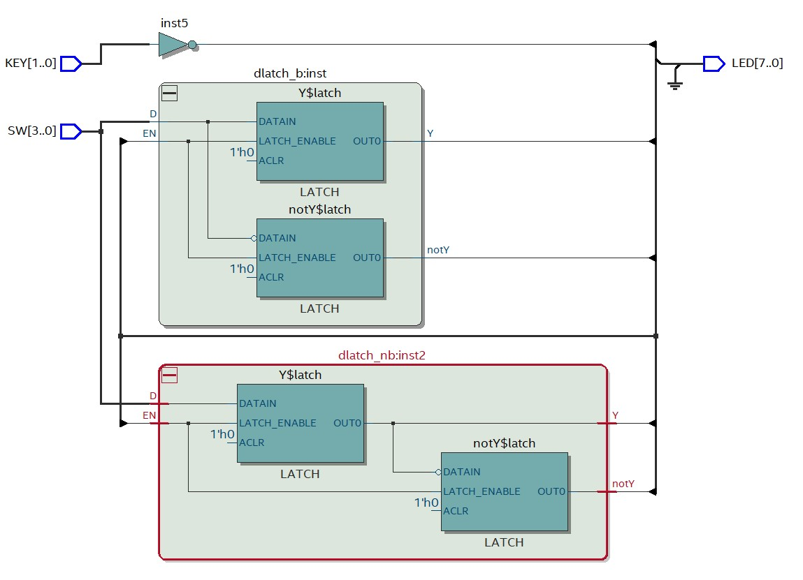

[Back](../README.md)

---

<figure>

</figure>

# Sequential Logic

In this section, we will begin to look at sequential logic circuits.

This practical session is designed to be standalone. However, chapter 5 in [1] will compliment it as supplementary reading.

| TABLE OF CONTENTS |
| - |
[Intended Leaning Outcomes](#Intended-Learning-Outcomes)
[Sequential Logic](#)
[Task 230: Implicit Latches](#Task-230-Implicit Latches)

[Challenges](#Challenges)
[Reflection](#Reflection)
[References](#References)

## Intended Learning Outcomes

By the end of this section, you should be able to:

* Create a component with latched outputs
* Contrast and correctly apply non-blocking and blocking assignments
* Contrast and correctly apply `always`, `always_comb`, `always_latch` and `always_ff` in a behavioural model
* Use an `excitation list` as part of a behavioural model
* Create a component that qualifies as a flip flop
* Simulate a clock signal for the purpose of testing
* Create common sequential building blocks, including a D-Latch, SR-Latch, D-FlipFlop and JK-FlipFlop 
* Use asynchronous inputs to define the startup state of a component
* Explain the role of propagation delay when cascading flip-flop devices

## Sequential Logic
In the previous section, we looked at creating combinational logic component in SystemVerilog. All digital systems contain combinational logic. 

You may recall that when the inputs of combinational logic change, the outputs need time to settle to a steady state. During this short period, outputs can be spurious and in some cases, even dangerous. 

Furthermore, combinational logic has no memory of the past. The output is simply a function of it's current inputs. The internal logic and outputs retain no means to remember previous values.

Sequential logic is so named because it is the sequence of events that are taken into account. Sequential logic outputs are function of the current and past inputs. To achieve this, some form of memory is needed, which is synthesised by way of logic circuits with feedback. This is described in section 5.1 of [1].

## Task-230 Latching Outputs
In this task, we will look closely at a device known as an S-R Latch. 

| Task-230 | Latching Outputs |
| - | - |
| 1 | [watch this video](https://plymouth.cloud.panopto.eu/Panopto/Pages/Viewer.aspx?id=3e2b3c6e-1a58-45d0-b735-ae2f00c85511) and replicate |
| 2 | Write a testbench `srgate_tb.sv` to automate the tests used in this video |
| - | A solution `srgate_tb-solution.sv` is provided | 

Some key points:

* When first used, the output was undefined `x`
* The output `Q` was set HIGH when input `S` was HIGH
* The output `Q` was set LOW when input `S` was LOW
* When `S` and `R` are both LOW, the output **latches** (holds it's value)
* When `S` and `R` are both HIGH, this is considered an illegal condition
* There is more than one type of `always` block. This has an impact on behaviour.

Let's now review the code below:

```verilog
module srgate (output logic Q, Qbar, input logic S, R);
always @(S,R) 
begin
	if ( (S==1) && (R==0) )
		{Q, Qbar} <= 2'b10;
	else if ( (S == 0) && (R == 1) )
		{Q, Qbar} <= 2'b01;
	else if ( (S == 1) && (R == 1) )
		{Q, Qbar} <= 2'bzz;
    // No coverage of the input combination 0,0!!!
end
endmodule
```

A critical point to observe is that the input combination `{S,R} = {0,0}` is not covered by the if-statement. By default, this creates an **implicit latch**. This behaviour was overridden when we changed `always` to `always_comb`, and forced the compiler to only use combinational logic (which cannot latch outputs).

Some other points to note:

* This component used something referred to as a **non-blocking assignment operator** `<=`
* The `always` statement is followed by `@(S,R)`. This is known as an *event list* (also known as an excitation list)

S-R Latches are just one type of latch.

### Excitation Lists
The excitation list (or event list) is a very important concept in both Verilog and SystemVerilog.

| Task-230 | continued |
| - | - |
| 3 | Compile and edit the solution `srgate_tb-solution.sv` | 
| 4 | Run the simulation. Note the output |
| 5 | Now watch [the following video](https://plymouth.cloud.panopto.eu/Panopto/Pages/Viewer.aspx?id=61f7d931-6535-4ec9-a155-ae2f0120e8c9) |
| 6 | Replicate what you saw in the video. Use the debugger in ModelSim to step through to better understand the behaviour being modelled |

An extract from the testbench is shown below. For this block, we can see the excitation list contains both `S` and `R`, so if either changes, so the block is updated and the values of `S` and `R` are written to the console. 

```verilog
//This block only runs when S or R **change**
always @(S,R)
begin
	$display("{S,R}={%b,%b}", S, R);
end
```

If `Q` changes as a result of `S` and `R` changing, then the following block detects this and displays the value of `Q`.

```verilog
//This block only runs when Q changes
always @(Q)
begin
	$display("Q => %b", Q);
end
```

Now we see how the excitation list is used to detect change events, let's return to the S-R Latch and look again at the excitation list:

```verilog
module srgate (output logic Q, Qbar, input logic S, R);
always @(S,R) 
begin
	if ( (S==1) && (R==0) )
		{Q, Qbar} <= 2'b10;
	else if ( (S == 0) && (R == 1) )
		{Q, Qbar} <= 2'b01;
	else if ( (S == 1) && (R == 1) )
		{Q, Qbar} <= 2'bzz;
    // No coverage of the input combination 0,0!!!
end
endmodule
```

The `always` block asserts `Q` and `Bbar`, but only update if `S` or `R` change. Updates to `Q` and `Bbar` are therefore synchronised with changes in either `S` or `R`. It should be stressed that unlike the testbench, this component can be synthesised.

| Task-230 | continued |
| - | - |
| 7 | What happens if you remove `R` from the excitation list? | 
| - | Also look at the wave output. Double click and error message to jump to the position in the wave |
| 8 | Now remove the excitation list entirely. Recompile and start the simulation. Do NOT click the Run -All button. This time step line by line through the simulation. |

Now how `always` without a excitation list performs an infinite loop?

| Task-230 | continued |
| - | - |
| 9 | Finally, change `always` to `always_latch` |
| - | Note this is only supported in SystemVerilog. Excitation lists are not permitted |
| 10 | Simulate - does the component behave correctly and pass all tests? | 

`always_latch` is usually preferred to `always` as it is safer. It will infer the correct excitation list (so you don't forget - an easy mistake to make!). Another way to do this is to use `always @*` (supported in Verilog) although they are not entirely equivalent.

### Variation
The example so far has used the familiar `if else`. You can also use a `case` statement.

```verilog
module srgate (output logic Q, Qbar, input logic S, R);
always_latch
begin
	case ({S,R})
		2'b10 : {Q, Qbar} <= 2'b10;
		2'b01 : {Q, Qbar} <= 2'b01;
		2'b11 : {Q, Qbar} <= 2'bzz;		
	endcase
	// Again, no coverage of the input combination 0 0
end
endmodule
```

## Task-232 Blocking and non-blocking assignment

You may have noticed the use of the non-blocking assignment operator `<=`. This was instead of the blocking assignment operator `=`.

There is quite a lot we could say about these two operators, and they are a source of confusion.

Inside an `always` block, the difference is essentially this:

* A blocking operator takes immediate effect
* A non-blocking operator does not take effect until the end of the block

| Task-232 | Blocking and non-blocking assignment |
| - | - |
| 1 | [watch this video]() and replicate |

This version uses the blocking assignment:

```verilog
module dlatch_b (output logic Y, notY, input logic D, EN);
always_latch
begin
	if (EN == 1) begin
		Y    = D;	
		notY = ~Y;
	end 
end
endmodule 
```

Contrast with this version, which uses the non-blocking assignment:

```verilog
module dlatch_nb (output logic Y, notY, input logic D, EN);
always_latch
begin
	if (EN == 1) begin
		Y    <= D;	
		notY <= ~Y;
	end 
end
endmodule 
```

<figure>

<figcaption>Course Icon</figcaption>
</figure>

## `@always` blocks


## Asynchronous Inputs

## D-Latch

## Edge Triggered Outputs - the D-Type flip-flop

## Testing Sequential Logic

## J-K Flip-Flop

## Modelling Delays

## Testing


## References

See [References](references.md) for a list of numbered references in this course.