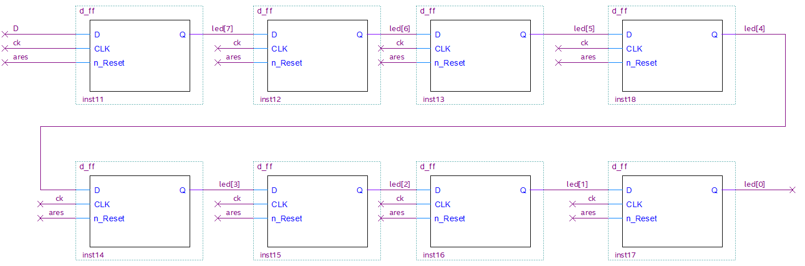

[Back](../README.md)

---

<figure>

</figure>

# Sequential Logic

In this section, we will begin to look at sequential logic circuits.

This practical session is designed to be standalone. However, chapter 5 in [1] will compliment it as supplementary reading.

| TABLE OF CONTENTS (TO BE DONE) |
| - |
[Intended Leaning Outcomes](#Intended-Learning-Outcomes)
[Sequential Logic Components](#Sequential-Logic-Components)
[Shift Registers](#task-242-shift-registers)
[Multiple Bit Registers](#multiple-bit-registers)
[Counters](#counters)
[Memory](#memory)
[Challenges](#Challenges)
[Reflection](#reflection)
[References](#References)

## Intended Learning Outcomes

By the end of this section, you should be able to:

* Cascade Flips Flops to build shift registers
* Compare, contrast and explain the terms set-up-time and hold-time
* Demonstrate the role of propagation delay in shift registers
* Design and test a multi-bit registers to store values
* Design and test sequential counters
* Read and write to memory storage
* Employ test strategies for sequential logic

## Sequential Logic Components
This sections makes use of the components developed in the [previous section](seq_logic.md) to build further reusable sequential components. It is very important to have a good understanding of latches and flip-flops before attempting this section.

There are many sequential logic devices we could build, but we will focus on a small subset. The practise and techniques learned will hopefully put you in a good position to develop your own.

A very important aspect of this is understanding the intrinsic (and sometimes engineered) timing properties of sequential logic, in particular flip-flops. We will therefore discuss propagation delay, setup-time and hold-time.

In future section, you will find that the components discussed in this section and the previous will be reused multiple times.

## Task-242 Shift Registers
It is recommended you read the accompanying text for this section: Section 5.4.2 in [1].

For this task, we will first look as a simple shift register using Quartus. The clock signal has been significantly slowed down (0.5Hz) so that you can interface meaningfully.

| Task-242 | Shift Registers |
| - | - |
| 1 | Open and build the Quartus project in Task242 | 
| 2 | Study the top level schematic. Double click the `cascaded_dff` component to see the internals (another schematic). Double click one of the `d_ff` components to see the HDL. |
| 3 | Now program your FPGA |
| 4 | Press and release KEY0 to reset the circuit |
| 5 | Press and hold KEY1 until the first and second LEDs light |
| 6 | Release KEY1 and observe |
| - | Experiment trying to create different LED patterns |
| 7 | Try to press and release KEY1 *between* clock edges - you should see it KEY1 is ignored |

Note how a symbol was created from another schematic? The shift register is shown below:

<figure>

<figcaption>Building a shift-register with cascaded D-Flip Flops</figcaption>
</figure>

Key points:

* The output of each D-Type Flip Flop (DFF) is connected to the input of the next
* All flip-flops share the same clock, so all outputs change simultaneously
   * We say there is no skew
* With each clock edge, the output of a DFF is shifted to the next

> **Question: ** Starting from reset, if you set `D` to 1 (hold down KEY1 for one clock cycle), why is it that only the first DFF has a 1 in the output? As all DFFs share the same clock, why does the signal not propagate throughout all DFF devices in one go? 

They key to this is propagation delay, set-up time and hold-time. This is best observed using simulation.

### Set-up and hold time
Below is the SystemVerilog for a DFF. This version is modelled with a fixed output delay of 10ps. This is the delay between the clock rising and the output changing.

From a simulation perspective:

* When the clock rises, the `always_ff` loop unblocks
* `q_int` is updated immediately (with zero delay)
* T<sub>d</sub>=`10ps` later, `Q` is updated

```verilog
module d_ff (output logic Q, input logic D, CLK, n_Reset);

logic q_int;
assign #(10ps) Q = q_int;

always_ff @(posedge CLK, negedge n_Reset) begin
	//Reset takes precedence
	if (n_Reset == 1'b0) begin
		q_int <= 0;
	end
	else begin
		//Otherwise Q = D (and latches)
		q_int <= D;
	end
end
endmodule
```

Now let us look at that happens when these devices are cascaded as we saw in Quartus

| Task-242 | Continued |
| - | - |
| 7 | Open the schematic `cascaded_dff` and convert to HDL  | 
| - | File -> Create/Update -> Create HDL Design File from Current File |
| - | Choose Verilog HDL. This will create a file `cascaded_dff.v` |
| - | Close Quartus, and move the created file `cascaded_dff.v` from the Quartus folder up to the parent task folder (up one folder) | 
| 8 | Start ModelSim, and compile all HDL files in the Task242 folder |
| 9 | Edit `cascaded_dff.v` and examine the HDL. See if you can understand how it works |
| 10 | Simulate `cascaded_dff_tb.sv` and show the output in a wave window |

If we take a close look at the output, you can see some important details:

<figure>

<figcaption>Shift-register output: showing the delay between the clock edge and the output </figcaption>
</figure>

Remember that for a flip-flop, inputs are only read on the clock edge (a **very** narrow time window!).

The numbers on the figure relate to the following points:

1. All DFF outputs are 0. The input D is a stable 1. Then the clock rises. *There is no immediate change in any of the DFF outputs due to intrinsic delays*. The delay for each output is T<sub>d</sub>.
2. After a delay of T<sub>d</sub>=`10ps`, `LED[7]` has now risen to a `1`. *At this point, no DFF devices are monitoring their inputs*, so this is currently ignored by the other DFF devices.
3. The input `D` is now a stable 0 and `LED[7]` is a stable `1`. `D` is connected to the input of the first DFF. `LED[7]` is connected to the input of the second DFF. The clock rises. Again, inputs are sampled there is no immediate change in any DFF output due to intrinsic delay.
4. After a delay of T<sub>d</sub>, `LED[7]` changes to `0` and `LED[6]`  changes to a `1`.

What I hope is becoming clear is that this circuit *only works because of the intrinsic delay in the flip-flops T<sub>d</sub>*. There are a couple more important parameters to be aware of:

**If you want to guarantee that the output of flip-flop will settle on the correct value, the input MUST be stable for a time T<sub>setup</sub> before the clocked edge and T<sub>hold</sub> after the clock edge**

* T<sub>setup</sub> is known as the set-up time
* T<sub>hold</sub> is known as the hold time

<figure>

<figcaption>Showing the set-up and hold times for a flip-flop. T<sub>setup</sub> is the time the input must be stable before the clock edge; T<sub>hold</sub> is the time the input must be stable after the clock edge; T<sub>d</sub> is the intrinsic delay between the clock edge the output changing. The input is captured either side of the clock edge. </figcaption>
</figure>

Usually, for a DFF, T<sub>hold</sub>=0. In words, once the clock has risen, any changes in the input `D` will be both ignored and tolerated.

A zero hold time is traded for a large setup time. T<sub>setup</sub> > 0. In words, the input `D` **must** be set and stable T<sub>setup</sub> in advance of the clock edge. *Failure to observe this can result in unpredictable outputs*.

In this circuit, the outputs of each DFF is an input to another. If T<sub>clk</sub> is the time between clock edges, then the inputs are stable (T<sub>clk</sub>-T<sub>d</sub>) in advance of the next clock edge. But we also have to allow for set-up time, so for this to work, the following much be observed:

T<sub>clk</sub> > T<sub>d</sub> + T<sub>setup</sub>

This limits how fast we can drive the clock before set-up violation occurs (so overclockers, beware!). We will revisit this topic later in the course. However, you can read more in section 13.5 in [1].

| Task-242 | Continued |
| - | - |
| 11 | Increase the clock frequency and show the circuit failing  | 
| 12 | In Quartus, click Tools -> Netlist Viewers -> RTL Viewer |
| -  | Expand all the components in `cascaded_dff` |

Note how on-chip FPGA D-Type Flip-Flops are used in the synthesised design.

### Behavioural Model
The example so far was derived from schematic capture, which tends to produce structural and dataflow style HDL. We can also model an equivalent shift register using behavioural HDL.

```verilog
module sipo #(parameter N = 8) (output logic [N-1:0] q, input logic D, clk, n_reset);

always_ff @(posedge clk, negedge n_reset)
	if (n_reset == 0)
		q <= '0;
	else
		q <= {D, q[N-1:1]};

endmodule
```

As before, this is pushing a bit `D` into most-significant bit position. The name `sipo` is an acronym for `Serial In Parallel Out`.

> **Note** the line that reads `q <= '0;`. As the size of `q` is known, so the width of the scalar `'0` is inferred to match. This is a useful shortcut and can help you write more generic modules.

The serial-in-parallel-out register is the basis for receivers in synchronous serial interfaces, such as SPI and I2C.

## Task-244 Multiple Bit Registers 
In this section, we look at a parallel-in-parallel-out **register**. This will be combined with the files in the previous section to build a simple serial to parallel interface.

It is recommended you read the accompanying text for this section: Section 5.4.1 in [1].

| Task-244 | Multiple Bit Registers |
| - | - |
| 1 | Open and build the Quartus project in Task244 | 
| 2 | Build and deploy to your FPGA board |
| 3 | Reset, then hold down `key0` for 8 seconds |
| 4 | Repeat for 4 seconds |

Note how the led's are only updated once every 8 clock cycles. The centre of this design is summarised in the figure below:

<figure>

<figcaption>Course Icon</figcaption>
</figure>

The shift register from the previous section clocks in the serial bits (generated by `key0`). On the 8th clock cycle, the output is stored in the 8-bit parallel-in-parallel-out (PIPO) *register*. This devices ignores it's inputs unless the `EN` pin is HIGH. This `EN` signal is generated by  `latch_controller` every 8 clock cycles.

This is a simple serial-to-parallel receiver. Serial data is clocked in, and once all bits are received, they are latched on the output to drive the LEDs.

| Task-244 | continued |
| - | - |
| 5 | Double click the `pipo` component to see how it is built |
| 6 | Now double click DFF component to see the HDL. Note this version as an enable input |

```verilog
//D-Type Flip-Flop (with asynchronous reset)
module d_ff (output logic Q, input logic D, CLK, n_Reset, EN);

logic q_int;
assign #(10ps) Q = q_int;

always_ff @(posedge CLK, negedge n_Reset) begin
	//Reset takes precedence
	if (n_Reset == 1'b0) begin
		q_int <= 0;
	end
	else begin
		//Otherwise Q = D (and latches)
		if (EN == 1) 
			q_int <= D;
	end
end
	
endmodule
```

Note the additional `if` statement. If not reset, and there is a rising clock edge AND the `EN` pin is HIGH, then the output `Q` is assigned to the input `D`. 

> Using the `EN` pin, we control whether we wish to store a bit or for the input to be ignored.

Let's now consider a fully behavioural model of a `PIPO` device.

```verilog
module d_ffN #(parameter N=8) (output logic [N-1:0] Q, input logic [N-1:0] D, input logic CLK, N_RESET, EN);

logic [N-1:0] q_int;
assign #(10ps) Q = q_int;

always_ff @(posedge CLK, negedge N_RESET) begin
	//Reset takes precedence
	if (N_RESET == 1'b0) begin
		q_int <= 8'b0;
	end
	else begin
		//Otherwise if EN=1 then Q = D (and latches)
		if (EN == 1) 
			q_int <= D;
	end
end
	
endmodule
```

Note how the input and outputs signals are `N` bit wide. Otherwise, this is very similar. A simulation is shown below:

<figure>

<figcaption>N-bit Parallel-In-Parallel-Out register. Note how the input `D` is ignored unless `EN`=1</figcaption>
</figure>

| Task-244 | continued |
| - | - |
| 7 | Write a testbench `d_ffN_tb.sv` to show the reset and latching behaviour of this component. |

Registers used to store binary words are central to many designs, and will be revisited many times on this course.

## Task-246 Parallel In Serial Out
So far, we have considered serial-in-parallel-out and parallel-in-parallel-out. To complete the set, we now look at the basis of serial data transmission, parallel-in-serial-out. For such a device we have the following fundamental requirements:

* The ability to load a parallel N-bit word into the register and store it
* The ability to shift the N-bits out one-by-one

| Task-246 | Parallel In Serial Out |
| - | - |
| 1 | Open the Quartus project in Task246 |
| 2 | Build and program the FPGA |
| 3 | Press and release key0 to reset |
| - | You should see the clock flashing on LED[7] |
| - | Set the DIL switched to the pattern 1010 |
| - | When the clock LED goes OFF, press and fold key1 to shift the bits into LED[0] |

In the schematic you can see a component `p2s`. Double-clicking this will reveal another schematic (shown below). 

<figure>

<figcaption>Parallel-to-Serial Shift Register with parallel LOAD and input enable</figcaption>
</figure>

Study this schematic so that you understand how it works. Because schematic capture was used, it would be easy to convert this to structural HDL. However, it is probably much quicker to use behavioural HDL

| Task-246 | Continued |
| - | - |
| 4 | Create a component `parallel_to_serial.sv` |
| 5 | Write a behavioural model of the figure above |
| - | Some key points are included below. A solution is provided |

**KEY POINTS**
* The device as a N-bit input `DATAW` used to LOAD an initial value into the DFFs (the register)
* If EN is HIGH
   * When SHIFT is LOW, the flip flops are initialised with the input `DATAW`. The lsb appears on the output immediately
   * When SHIFT is HIGH, the bits are shifted right on each clock edge. A zero is shifted into the msb position.
* If EN is LOW, the component will neither LOAD or SHIFT
* Reset takes precedence of all the above and sets the outputs of the DFFs to zero.
* Hint: your internal shift register is simple created with `logic [N-1:0] sr;`

## Task-248 Counters
Counters are a very commonly used device. Section 5.5 in [1] details some of the different types, including:

* Binary counter
* Johnson counter
* Linear Feedback Shift Register (LFSR)

We will look at a simple binary counter.

| Task-248 | Counters |
| - | - |
| 1 | Using ModelSim change the folder to Task248 |
| 2 | Compile `counterN.sv` |
| 3 | Simulate this component and test interactively. Force `N_RESET` to 0 and force CLK to be a clock. Run for one clock cycle, the force `N_RESET` to 1 |
| - | Observe the output counting |

Let us look at this code more closely:

```verilog
module counterN #(parameter N=8) (output logic [N-1:0] Y, input logic CLK, input logic N_RESET);

logic [N-1:0] count;

//Connect output to internal register count
assign Y = count;

always_ff @(posedge CLK) begin
	if (N_RESET == 0) 
		count <= 0;
	else
		count <= count + 1;
end

endmodule
```

Note that an asynchronous reset is used to reset the count. Without this, we cannot guarantee the counter will start at zero. The counter counts on the positive edge of the clock.

As an exercise in using Quartus, attempt the following tasks (check with the tutors if you get stuck).

| Task-248 | continued |
| - | - |
| 4 | Open the Quartus project and add this file to the project |
| 5 | Create a component based on this module |
| 6 | Add the component to the schematic |
| - | Use CK2 as the clock |
| - | Use key0 as the reset |
| - | Set the parameter N to 8 |
| - | Connect the output to the LEDs |
| 7 | Build and program to see the counter driving the LEDs |

Now let's add an an additional input. 

| Task-248 | continued |
| - | - |
| 8 | Add an additional input `DIR` that controls the direction of the count (Up or Down) |
| 9 | Connect this to key1 |
| 10 | Test on the FPGA |

If you leave it long enough, the counter will overflow or underflow. You might prefer the counter only counts up to 2<sup>N</sup>-1 or down to 0.

| Task-248 | continued |
| - | - |
| 11 | Add some additional logic to stop the counter counting beyond the maximum value or below 0 |
| 12 | Again, test on the hardware |

There are other counters you could build (see the [challenges](#challenges) if you have time! )

## Task-250 Memory
Storing data in memory is a common feature of a digital system. Memory divides broadly two categories:

* Read Only Memory (Often called ROM)
* Read/Write Memory (Often called RAM)

Memory can be synthesized with logic gates, but modern FPGA devices often have banks of on-device memory. 

Read section 5.6 in [1] for more details.

We are going to focus on two examples: Using a ROM to implement combinational logic and synchronous RAM.

TBD

## Challenges

1. In Task-242, a file `cascaded_dff` was created by Quartus. Can you shorten this file by using the `generate` statement?

2. In Task-248, write a testbench to show that the counter can count up, count down, and does not overflow or underflow. Tip: use a smaller `N`=4 to keep it shorter.

3. Build and test a Johnson counter (see 5.5.2 in [1])

## Reflection

## References

See [References](references.md) for a list of numbered references in this course.

---

[Next - Sequential Logic Components](seq_logic_components.md)